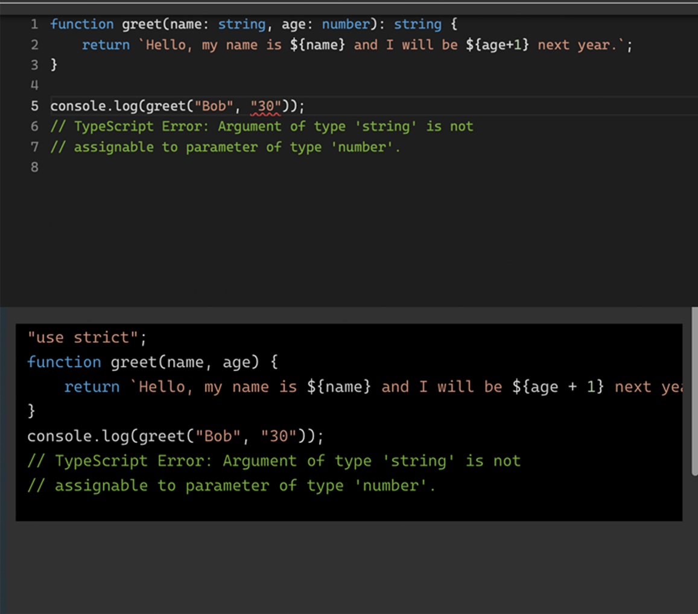

# 1.  Why TypeScript and Why This Book

**This chapter covers**

- How this book will help you, the reader
- Why this book and not some other resource
- Why TypeScript is a *must* language to learn for web development
- A brief overview of how TypeScript works

Did you open this book expecting to immediately delve into the TypeScript guide and TS mistakes to avoid? Surprise! You've already stumbled onto the first mistake---underestimating the entertainment value of an introduction. Here you thought I'd just drone on about how you're holding in your hands the quintessential guide to TypeScript and its pitfalls. That's half correct. The other half? Well, let's just say I wrote the introduction while sipping my third cup of coffee, so hold onto your hats because we're going on a magical carpet ride through the benefits that this book provides and touch upon how this book can help you, before we arrive at TypeScript land.

Navigating the world of TypeScript can be a challenging and yet a rewarding journey at the same time. As you delve deeper into TypeScript, you'll quickly discover its power and flexibility. However, along the way, you may also stumble upon common pitfalls and make mistakes that could hinder your progress. This is where this book comes in, serving as your trusty companion and guide to help you avoid these obstacles and unlock the full potential of TypeScript.

Here's a little programmer humor to lighten the mood: Why did the developer go broke? Because he used up all his cache. Just like that joke, TypeScript can catch you off guard.

Consider the following as the key benefits you will gain from this book:

- **Enhance your understanding of TypeScript**: By studying the common mistakes, you'll gain a deeper insight into TypeScript's inner workings and principles. This knowledge will allow you to write cleaner, more efficient, and more maintainable code.

- **Improve code quality**: Learning from the mistakes covered in this book will enable you to spot potential issues in your code early on, leading to a higher quality codebase. This will not only make your applications more robust but also save you time and effort in debugging and troubleshooting.

- **Boost productivity**: By avoiding common mistakes, you can accelerate your development process and spend more time building features and improving your application, rather than fixing errors and dealing with technical debt.

- **Strengthen collaboration**: Understanding and avoiding these mistakes will make it easier for you to work with other TypeScript developers. You'll be able to communicate more effectively and collaborate on projects with a shared understanding of best practices and potential pitfalls.

- **Future-proof your skills**: As TypeScript continues to evolve and gain popularity, mastering these concepts will help you stay relevant and in-demand in the job market.

Maybe you've tried mastering TypeScript before and didn't quite get there. It's not your fault. Even for me some TypeScript errors are perplexing and the reasoning behind them (or a lack of thereof) confusing. I suspect the authors of TypeScript intentionally made the error messages so cryptic as to not allow too many outsiders to enlighten in the mastery of types.

And TypeScript is a beast, it's powerful and its features are vast! Learning TypeScript deserves reading a book or two to get a grasp on it and then months or years of practice to gain the full benefits of its all features and utilities. However, as software engineers and web developers, we don't have a choice not to become proficient in TypeScript. It's so ubiquitous and became a de facto standard for all JavaScript-base code.

All in all, we must learn TypeScript, because if we don't do it, it's easy to fall back to just old familiar JavaScript that would cause the same familiar and painful issues like type-mismatch, wrong function arguments, wrong object structure and so on. Speaking of old JavaScript code, let's see why we even should bother with TypeScript.

## 1.1.  Why TypeScript?

Believe it or not, TypeScript has been climbing the popularity ladder at an impressive pace in recent times. Heck, it became one of the most widely used programming languages in the software development world, if not THE MOST popular one. This is because most of software engineering is web-based now whether because of the need of a cloud backend or because the desktop apps are just web apps wrapped in a browser (Electron, Chrome PWAs). At this rate, I wouldn't be surprised if people started naming their pets TypeScript. Can you imagine? "Come here, TypeScript, fetch the function!"

As a pumped-up superset of JavaScript, the language with the most runtimes in the world (i.e., browsers, desktop apps on Electron, mobile apps on React Native), TypeScript builds upon the foundation of it and enhances it with static typing, advanced tooling, and other kick-ass features that improve developer experience and code quality. No wonder it's the apple of every developer's eye, albeit an apple with fewer bugs! It allows developers to have a JavaScript cake and eat it too! But what exactly makes TypeScript so irresistibly attractive to developers and businesses alike? Is it its charisma? Its stunning looks? Or perhaps its irresistible charm? Let's explore some of the key reasons behind TypeScript's growing popularity.

- Static typing: TypeScript introduces static typing to JavaScript, which helps catch errors early in the development process. By providing type information, TypeScript enables developers to spot potential issues before they become runtime errors. This leads to more reliable and maintainable code, ultimately reducing the cost and effort of debugging and troubleshooting.

- Improved developer experience: TypeScript's static typing also empowers editors and IDEs to offer better autocompletion, type checking, and refactoring capabilities. This tooling and editor support enhances the development experience, making it easier to write, navigate, and maintain code. As a result, developers can be more productive and efficient in their work.

- Codebase scalability: TypeScript is designed to help manage and scale large codebases effectively. It uses type inference to give great tooling. Its type system, checks, modular architecture, and advanced features make it easier to organize and maintain complex applications, making TypeScript an excellent choice for both small projects and enterprise-level applications. In other words, TypeScript gives developers better tooling at any scale.

- Strong community and ecosystem: TypeScript has a vibrant and growing community that continually contributes to its development and offers support through various channels. The language is backed by Microsoft, ensuring regular updates, improvements, and long-term stability. Additionally, TypeScript's compatibility with JavaScript means developers can leverage existing libraries and frameworks, simplifying the adoption process and reducing the learning curve (see bullet point Gradual adoption).

- Future-proofing: TypeScript often incorporates upcoming JavaScript features, enabling developers to use the latest language enhancements while maintaining compatibility with older browsers and environments. This keeps TypeScript projects on the cutting edge and ensures that developers are prepared for the future evolution of the JavaScript language.

- Gradual adoption: One of the key benefits of TypeScript is that it can be adopted incrementally. Developers can introduce TypeScript into existing JavaScript projects without having to rewrite the entire codebase. This allows teams with existing JavaScript code to gradually transition to TypeScript and realize its benefits at their own pace, or keep the old JavaScript code and start using TypeScript for new development. TypeScript can run anywhere JavaScript runs: Node.js, Demo, Electron. Tauri, React Native.

- Code sharing: Because TypeScript has types, it's safer, more reliable and less error prone to use modules written in TypeScript in other modules, programs and apps. The quality goes up and the cost and time go down. The developer experience is also greatly improved because of autocompletion and early bug catches. TypeScript is amazing for code sharing and code reuse, be it externally as open source or internally as inner source (to the company the developer works at).

- Improved employability, job prospects and salary: As TypeScript become the de-facto standard for web development (a vast if not the biggest part of software development), not being proficient in it could be detrimental to your career. Moreover, survey data indicates that TypeScript developers generally bring home heftier paychecks than their JavaScript counterparts.

In conclusion, TypeScript is a powerful and flexible programming language (and tooling) that combines the popularity and strengths of JavaScript with additional features aimed at reducing bugs, improving code quality, developer experience, developer productivity, and project scalability. By choosing TypeScript, developers can write more robust, maintainable, and future-proof applications, making it an excellent choice for modern software development projects. Next, let's see how TypeScript actually works.

## 1.2.  How does TypeScript work?

So, here's a joke for you: Why didn't JavaScript file a police report after getting mugged? Because TypeScript said it was a *superset*, not a suspect! TypeScript is a statically typed superset of JavaScript that compiles to plain JavaScript. In other words, TypeScript extends the JavaScript language by adding optional static types and other features, like interfaces, generics, enums, optional chaining and many more. These enhancements and additions of TypeScript aren't merely to show off, but were designed to make it easier to write and maintain large-scale applications (or as they're formally known at black-tie events, "enterprise apps"). These additions provide better tooling, more rigorous error checking, and superior code organization.

Here's a mental model of how TypeScript works at a high-level:

- Code writing: A developer writes TypeScript code. TypeScript code is written in files with a .ts extension. You can use all JavaScript features as well as TypeScript-specific features like types, interfaces, classes, decorators, and more. Depending on the editors, project configurations and build tools, the developer sees prompts, early warnings and errors (from static type checking).

- Type checking: TypeScript helps catch errors during development. You can add optional type annotations to variables, function parameters, and return values. TypeScript's type checker analyzes your code and reports any type mismatches or potential issues before the code is compiled. Type checking is done on the fly by the editor (IDE) or a compile tool in watch mode.

- Build compilation: TypeScript code must be compiled (or "transpiled") to plain JavaScript before it can be executed in browsers or other JavaScript environments. The TypeScript compiler (tsc) is responsible for this process. It takes your TypeScript source files and generates JavaScript files that can run in any compatible environment. It's worth mentioning that most of the compilation is stripping down of extra code like types with some exception like down leveling, e.g., making an async functions work in ES5.

- Bundling: At this point, JS code is bundled with other JS/TS dependencies and even CSS and images to be ready for development, staging or production deployment. Depending on environments, bundles will be built with different configurations. This is where tools like Webpack, Babel, Rollup, Gulp, ESBuild come to play.

- Execution: Once your TypeScript code has been compiled to JavaScript, it can be executed just like any other JavaScript code. You can include the generated JavaScript files in your HTML files, serverless functions or run them in a Node.js environment, for example.

Alongside of all the five steps of our mental model of how TypeScript works at a high level, TypeScript provides an excellent tooling support in all most popular modern code editors (IDEs) like Visual Studio Code (VS Code), Eclipse, Vim, Sublime Text, and WebStorm. These tools are like the magic mirror in Snow White---always ready to give real-time feedback on type errors, autocompletion, and code navigation features to make your development faster and more efficient. Here's a joke for you: Why don't developers ever play hide and seek with their IDEs? Because good luck hiding when they keep highlighting your mistakes!

Consider this example, in which we intentionally have a type mismatch. The function argument age needs to be a number, but in the function call a string 30 is provided. The result of the function is 301 instead of 31. However, TypeScript helps us to catch the error before even running the code by showing us a red line and an error message Argument of type 'string' is not assignable to parameter of type 'number'.

{alt: "A screenshot of a computer program Description automatically generated", width: "100%"}

Figure 1.1 TypeScript Playground shows errors in the editor helping to catch bugs without running the code

In summary, TypeScript works by extending the JavaScript language with optional static types and other features, providing better tooling and error checking. The process is simple: You craft your TypeScript code, which then goes through a type-checked (robust, if it's written properly or meh if there are too many anys and unknowns). Then, the code gets compiled to plain JavaScript, which can be executed in any JavaScript environment. Like a chameleon, TypeScript blends in, working its magic anywhere JavaScript can.

Yet, TypeScript isn't all sunshine, error-free rainbows, and sweet-smelling roses. It has its quirky, often misinterpreted, and slippery aspects. That's precisely the reason this book came into existence. Now, let's delve into how this tome is structured to lend a helping hand in your TypeScript journey.

## 1.3.  How this book is structured

For the ease and fun of the readers, this book on 100 most common and critical TypeScript blunders is categorized into these main classifications: 

* Basic Mistakes 
* Mistakes with Types, Type Aliases and Interfaces
* Mistkaes with Functions and Methods
* Mistkaes with Classes and Constructors
* Advanced Parts and Bad Parts

The different chapters are based on their nature and impact. Each mistake will be thoroughly explained, so you can grasp the underlying issues and learn how to avoid them in your projects. We'll provide examples that are as eloquent as a Shakespearean sonnet (but with more code and fewer iambic pentameters), followed by practical solutions and best practices that you can seamlessly integrate into your codebase.

In the appendices, you'll set up TypeScript (for code examples), TypeScript cheat sheet and additional TypeScript resources and further reading. Now we know what to expect but how to use the book most effectively, you, my dear reader may ask.

## 1.4.  How to use this book

I recommend reading, or at least skimming, the book from beginning to the end starting with chapter 2 Basics. "This chapter cover" and Summary bullets that each chapter has, are extremely useful for skimming the content. Even my publisher just read those bullets, not the entire book, before okaying the book. At least that's what I've heard.

As far as the code is concerned, most of the code is runnable in either a playground or files on your computer. There are plenty of free TypeScript playground/sandbox browser environments. I used the one at the official TypeScript website located at: [typescriptlang.org/play](https://www.typescriptlang.org/play). If you want to run code on your computer, I wrote the step-by-step instruction for the simplest TypeScript set up and installation in Appendix A: TypeScript Setup.

I recommend reading a paper book with a cup of coffee in a comfortable ergonomic position (sofa, armchair) and void of distractions. This way you can comfortably skim the book and get a grasp of ideas. It's hard to read this book on a plane, train, metro, or café due to noise and distractions but definitely possible. Or alternatively, I recommend reading a digital book on your computer with the code editor or playground open and ready for copy/pasted code to be run. This way you will get a deeper understanding of topics and be able to play around with the code. Experimentation with code will make the examples live and the reading more interactive and engaging. Experimentation with code can lead to that "Aha!" lightbulb in your head moment.

And lastly, please don't be frustrated with typos, omissions, and errors. Hopefully there won't be many because Manning has a stellar team! However, after I've wrote 20 books and learned that typos and mistakes are inevitable no matter how many editors and reviewers (at readers) looked at them. Simply submit errata to Manning for future editions. We'll be glad you did.

## 1.5.  For whom this book is intended

It's worth noting that the *50 TypeScript Mistakes* book is for TypeScript absolute beginners and advanced beginners. The persona I had in mind when writing the book is that of a professional software engineer who is new to TypeScript and JavaScript as well. A lot of TypeScript is rooted in JavaScript so sometimes we need to understand how things are working in JavaScript to understand them in TypeScript. I wrote for a person that is new to JavaScript and doesn't have two decades years of experience like me. You'll be the judge if I succeded. My editors always commented that I need to explain more and I did. But at the same time, this book has only necessary information and no fluff, no B.S. 

The book is also for engineers who worked with TypeScript and can get around but haven't had time or the opportunity to understand what the heck is going on. The book is perfect for those TypeScript enthusiasts who've dipped their toes in the water but are still occasionally puzzled by what on earth is happening. Maybe they've worked with TypeScript, and can generally navigate its waters, but haven't yet had the chance to dive deep. This is a great book for them!

On the other hand, if you're a TypeScript virtuoso, someone who can recite the TypeScript docs and its source code like your favorite song lyrics, then this book might not be your cup of tea. No offense, but I didn't write it for the TypeScript rockstars who've already had their own world tour. Why? Well, I wanted to keep this book as succinct as a stand-up comedian's punchline. Speaking of comedy: Why did the TypeScript developer get a ticket while driving? Because they didn't respect the "type" limit!

This book should not be seen as a substitute for TypeScript documentation. By design, the documentation is comprehensive, lengthy, and let's face it, as exciting as watching paint dry. It's a rare breed that finds joy in perusing technical documents, and I'm not one of them. I'd rather watch an infinite loop in action. Unless you're armed with a book like this, you're stuck with those sleep-inducing documents. Here's the last joke of the chapter to lighten things up: why don't developers ever read the entire TypeScript documentation? Because it's not a "type" of fiction they enjoy!

Technical documentation, while necessary, is rarely riveting. That's where this book strides in, promising to be a shorter, focused, and significantly more enjoyable read than the docs. We've carefully crafted small, digestible, yet illustrative examples---think of them as appetizing coding tapas, perfect for better understanding without the indigestion.

## 1.6.  Why this book will help you

To encourage readers, I wanted to begin by saying something profound, like, "To err is Human; to Fix errors through your TypeScript codebase, Divine." But you probably didn't buy this book for my philosophical meanderings or half-baked humor. You're here to learn, or, more accurately, unlearn - the TypeScript mistakes you've been making and didn't even know about. Don't worry, we've all been there. It's not your fault! Some of us are still there, hopelessly lost in a labyrinth of transpiled JavaScript. 0

Remember that a mistake is not a failure; it's simply proof that you're trying. And if you're trying, you're improving. To those who have ever shouted, "WHY, TypeScript, WHY?" at your monitor in the early hours of the morning, I want you to know something: I've been there too. It's not your fault that TypeScript oftentimes has this cryptic error messages. Having worked in the tech industry for years, at small startups to tech behemoths, I've had the privilege (or misfortune?) of committing a myriad of JavaScript and TypeScript mistakes at a scale that is, quite frankly, frightening. I've stared into the abyss of untyped variables, fought the battle with the legion of incompatible types, and been led astray by the enigmatic "any". Heck, I've got the emotional debugger scars to prove it. But don't worry, I'm not here to remind you of the nightmares; I'm here to tell you that there's a TypeScript oasis, and together, we'll find it.

Think of this book as your TypeScript best friend - a best friend who will tell you if you've got a metaphorical spinach in your teeth (read: a glaringly obvious bug in your code), and who'll laugh about it with you instead of letting you walk around all day like that. You're about to delve into the minefield of TypeScript. It's a journey of a hundred steps, each one a pitfall I've tripped into so that you don't have to.

The difference between this book and other books is in that this book has short bit-sized nuggets of practical tips and knowledge, and this book is recent and full of the latest TypeScript features while most of the other TypeScript books are years year. This book will hold up its recency in the next few years well because a) the book focuses on the fundamentals that are not likely to change b) TypeScript itself turned into a widely adopted, mature proven, tried and tested technology that is not likely to change much even with new major releases.

Moreover, this book is free of ads, news or funny cat videos comparing to YouTube or free blog posts. This book is *almost* free of typos and has decent grammar, thanks to the wonderful team of expert editors at Manning Publications. Also, this book is entertaining (at least it tries to be). Therefore, if you dream of being fluent in TypeScript, quicker building out product features *and* with a higher quality so that you can sleep soundly at night and not be disturbed by pesky on call rotation, then this is the resource for you. This book will give you peace of mind and expertise needed to eat your cake and have it too. After all, what's the point of having a cake if you can't eat it!

Remember, you don't have to be great to start, but you have to start to become great. The only way out is through, and if there's one thing, I promise it's this: you're going to make it to the other side. Because here's the thing about mistakes: everyone makes them, but the real jesters are those who don't learn from them (pun intended: jesters are not related to a popular testing framework). 

And remember, no matter what and how much you may hate TypeScript, keep in mind that TypeScript loves ❤️ you! 

Connected to that, how does TypeScript express its love? "Our relationship has a lot of potential... once it's been properly defined and strictly typed."

## 1.7.  Summary

- TypeScript is popular and powerful language that offers myriads of benefits such as static typing, codebase scalability, improved developer experience, gradual adoption, futureproofing, strong community and ecosystem, and improved employability, job prospects and salary.

- TypeScript is a superset of JavaScript meaning TypeScript can do everything that JavaScript can and then much, much more. One of its primary benefits is catching type-related errors at compile-time rather than runtime.

- This book is designed to be a quick, fun and accessible resource for advanced-beginner level TypeScript developers.

- By identifying, analyzing, and rectifying the 100 most common and critical TypeScript mistakes, you'll be well-equipped to tackle any TypeScript project with confidence and skills.

- The book contains chapters that can be grouped into four categories: TypeScript basics, TypeScript patterns, TypeScript features, and how TypeScript works with libraries/frameworks.

- The author of the book, Azat MARDAN, has tons of experience with TypeScript, wrote best-selling books (Practical Node.js, Pro Express, React Quickly), and worked at tech juggernauts (Google, Capital One), medium-sized tech companies (DocuSign, Indeed) and small startups (two exits).

- It's not your fault that you TypeScript is hard. Once you know it, you'll gain a lot of power.
