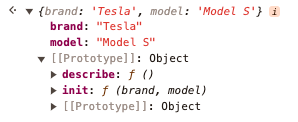
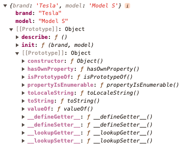

# 5. Classes and Constructors

**This chapter covers**

- Implementing interfaces and abstract classes

- Managing static members and access modifiers

- Initializing class properties

- Organizing class getters and setters

- Ensuring safe overrides

- Using decorators in classes

Historically, JavaScript was designed as a functional language with some object-oriented programming (OOP) features. In a way, JavaScript tries to be both a functional language and an OOP language. As an example, Array.map() and Array.reduce() are very functional methods, while const tesla = Object.create(Car) is OOP. A few years ago, the class syntax was added to JavaScript (a.k.a. syntactic sugar). Before this introduction, software engineers had to write prototypal or function factory inheritances. However, class is just a syntax, that under the hood still follows the good old prototype-based model for better or worse. In relation to the class, let me ask you this question: why did the JavaScript file become a TypeScript file? Because it wanted to get in touch with its “inner class”! :-)

In modern day and age, most developers just use class and don't bother to understand it. But I know you are a more thorough type of a person because you bought this book. Indeed, it's fundamental to grasp the prototypal nature of JavaScript/TypeScript to avoid many pesky mistakes (with class too). And understanding JavaScript's prototypal inheritance is like trying to untangle headphones that have been in your pocket for a week. Just when you think you've figured out the pattern, you find another knot! Thus, let's brush up on these concepts to really understand nuts and bolts.

First, please consider this example that uses prototypal inheritance to achieve OOP-like inheritance in JavaScript/TypeScript in which we define an object prototype Car that is just like any other objects. It has two methods init and describe.

```typescript
const Car = {
  init: function (brand, model) {
    this.brand = brand;
    this.model = model;
  },

  describe: function () {
    return `${this.brand} ${this.model}`;
  },
};
```

The Car object that we just defined can be used akin to a class (albeit with caveats). So, we can create a new object (instance) tesla based on the Car object (which is called and acts as a prototype):

```typescript
let tesla = Object.create(Car);
tesla.init("Tesla", "Model S");

console.log(tesla.describe()); // Output: Tesla Model S
```

In the above code, Car serves as an object prototype. This is analogous to a class in other OOP languages: tesla can invoke methods init and describe. In a way by using Object.create(Car), we generated a new object that is "an instance" of Car. Nonetheless, it's not a true class. If we inspect tesla closer, brand and model will be attributes (properties) of this object, but describe and init will be attributes of its prototype:

{alt: "A screenshot of a computer code Description automatically generated", width: "60%"}


The Car object itself has a prototype like any JavaScript/TypeScript object. This is how we get functions like toString().

{alt: "Insert a description of the image here", width: "80%"}


And you may wonder why does it matter if a method is on a prototype or an instance? It matters because when or if the prototype method is changed, it'll be automatically changed on all instances. For example, changing describe on Car will automatically change it on tesla leading to "Toyota Corolla" output instead of "Tesla Model S" as previously:

```typescript
Car.describe = () => `Toyota Corolla`;
console.log(tesla.describe()); // Output: 'Toyota Corolla'
```

Depending on whom you ask, this prototypal "linkage" to "class" could be a feature or a bug. To me it's more of a bug because it nipped me in the rear many times!

With ES6, JavaScript adopted the class syntax as syntactic sugar over this prototype-based system to provide a more familiar syntax for programmers coming from class-based OOP languages. Here is how the above example would be rewritten using ES6 classes. First, we define a class Car which is a class with a constructor and a method named describe:

```typescript
class Car {
  constructor(brand, model) {
    this.brand = brand;
    this.model = model;
  }

  describe() {
    return `${this.brand} ${this.model}`;
  }
}
```

Now we can create new instances of the Car class. A new instance of Car is created with a new Car("Tesla", "Model S"), and this instance has access to the describe method from the class definition. Consequently, we create another instance alfaRomeo.

```typescript
let tesla = new Car("Tesla", "Model S");
console.log(tesla.describe());            // #A

let alfaRomeo = new Car("Alfa Romeo", "Giulietta");
console.log(alfaRomeo.describe());        // #B
```

`#A Output: Tesla Model S`
`#B Alfa Romeo Giulietta`

As a result, changing the class's describe will lead to new behaviors in all instances (different outputs):

```typescript
Car.prototype.describe = function() {     // #A
  return `${this.model} - ${this.brand}`
}

tesla.describe()                          // #B
alfaRomeo.describe()                      // #C
```

`#A Class puts the properties in the prototype of Car unlike the previous example with object-based prototypes`
`#B Model Y - Tesla`
`#C Giulietta - Alfa Romeo`

And by the way, the naming of "class" (or prototype object) is totally conventional meaning, you don't have to upper case it (e.g., Car) but that's what is the accepted (by most) style. On the other hand, instances of "class" (or prototype), e.g., tesla, are often all lower case, because they kind of less important, maybe? I beg your pardon, but I just can't resist this joke when writing about classes: Why did the TypeScript programmer get kicked out of school? Because he refused to join any class without a defined constructor!

As a result, it's true that the advent of TypeScript has revolutionized JavaScript by bringing static types and interfaces into the language. ES6 made classes mainstream as opposed to pure prototypal inheritance (but I still like the function factories myself). As a developer, if you're coming from an object-oriented programming language like C# or Java, you'll find TypeScript's class syntax strikingly familiar. But just because something looks familiar doesn't mean it operates identically. This is certainly true for TypeScript classes and constructors, a misunderstood concept with a few idiosyncrasies that can lead to costly mistakes. One might presume that TypeScript, being a superset of JavaScript, would adhere to the rules and limitations of JavaScript for Classes. This is generally true, but TypeScript introduces additional features and checks that can catch developers off guard. Even for experienced developers, the differences can cause confusion and lead to errors.

## 5.1. Understanding When to Implement Interfaces for Classes

Interfaces are a core feature of TypeScript that allow you to define contracts for objects and functions. When you define an interface, you are specifying a set of properties or methods that an object or function must have in order to be considered "compatible" with the interface. However, in TypeScript we don't always have to define a separate interface for each class. Let's start with a simple example that has a User class with three properties and a constructor that upon initialization assigns those properties values passed to the constructor method:

```typescript
class User {
  id: string;
  email: string;
  password: string;

  constructor(id: string, email: string, password: string) {
    this.id = id;
    this.email = email;
    this.password = password;
  }
}

const newUser = new User("1", "Dima Ivanov", "123");
```

The newUser object has a type of User. In a way, TypeScript automagically created type User from the class definition and then assigned type User to newUser when it saw the assignment operator const newUser = new User(). When I mistakenly try to add a new property with newUser.isAdmin = true;, I'll get a TS problem "Property 'isAdmin' does not exist on type 'User'."

This code is fine for a lot of use cases, but what will ensure that the class itself adheres to a certain shape? Thus, the example is missing a _crucial_ part - an interface. Without an interface, we are losing TypeScript's capability to enforce the shape of classes themselves. For example, if we have a common interface for any users then we can create classes that implement the base interface while adding additional functionality. This way we can be rest assured that the common parts are implemented, and no one can accidentally miss a required property. By using an interface, we get an additional layer of safety ensuring that our class adheres to a specific contract.

Here's how we can improve the previous code by adding an interface IUser that is used for User. And yes, before I wrote that prefixing with I is a bad tone in the TypeScript coding style but here it's helpful to see the difference between User class.

```typescript
interface IUser {                 // #A
  id: string;
  email: string;
  password: string;
}

class Editor implements IUser {   // #B

  id: string;
  email: string;
  password: string;
  editRights: string[] = [];     // #C

  constructor(id: string, email: string, password: string) {
    this.id = id;
    this.email = email;
    this.password = password;
  }
}

class Viewer implements IUser {  // #D

  id: string;
  email: string;
  password: string;
  viewRights: string[] = [];     // #E

  constructor(id: string, email: string, password: string) {
    this.id = id;
    this.email = email;
    this.password = password;
  }
}

const viewer = new Viewer("1", "Rohan Gupta", "123456");
const editor = new Editor("2", "Priya Chatterjee", "p@ssword1");
```

`#A Define the interface with common required properties`
`#B Implement the interface for the Editor class`
`#C Property unique to Editor`
`#D Implement the interface for the Viewer class`
`#E Property unique to Viewer`

Now, we have an IUser interface, and our Editor and Viewer classes implement this interface. This means if we failed to implement any method or property from the interface in our class, TypeScript would alert us with errors. Similarly, if one of the methods had a different signature or parameters, we would receive an error. Conversely, if we were to add a new method or property to our class that isn't defined in the interface, TypeScript would be okay with it.

```typescript
interface IUser {
  id: string;
  email: string;
  password: string;

  getPermissions(): string[];
}

class PasswordLessUser implements IUser {  // #A
  id: string;
  email: string;
  phone: string = "";                     // #B

  getPermissions() {
    return "organizations:view";          // #C
  }

  constructor(id: string, email: string) {
    this.id = id;
    this.email = email;
  }
}
```

`#A Class 'User' incorrectly implements interface 'IUser'. Property 'password' is missing in type 'PasswordLessUser' but required in type 'IUser'.`
`#B Property 'getPermissions' in type 'PasswordLessUser' is not assignable to the same property in base type 'IUser', because the return type needs to be an array of strings, not a single string.`

Interestingly, we can also use interfaces (IUser) as types for objects instead of User class:

```typescript
const newUser: IUser = new User("1", "Dima Ivanov", "123");
```

In this case, while the class can have additional properties like phone that are not in the interface IUser, if we specify the type as IUser on newUser, the properties must match strictly. So, in the following code, we will get an error "Property 'phone' does not exist on type 'IUser'":

```typescript
const newUser: IUser = new User("Dima Ivanov", 30);
console.log(newUser.phone);
```

Have you noticed that in Viewer and Editor we ended up duplicating a lot of code? Why not use a base class to make code more eloquent and improve readability and maintenance?

```typescript
interface IUser {
  id: string;
  email: string;
  password: string;
}

class User implements IUser {            // #A
  id: string;
  email: string;
  password: string;

  constructor(id: string, email: string, password: string) {
    this.id = id;
    this.email = email;
    this.password = password;
  }
}

class Viewer extends User {
  viewRights: string[] = [];

  addViewRight(right: string): void {    // #B
    this.viewRights.push(right);
    console.log(`View right added: ${right}`);
  }
}

class Editor extends User {
  editRights: string[] = [];

  addEditRight(right: string): void {    // #C

    this.editRights.push(right);
    console.log(`Edit right added: ${right}`);
  }
}

const viewer = new Viewer("1", "Rohan Gupta", "123456");
const editor = new Editor("2", "Priya Chatterjee", "p@ssword1");

viewer.addViewRight("Read Articles");    // #D
editor.addEditRight("Modify Articles");

console.log(viewer);
console.log(editor);
```

`#A Base class`
`#B Method to add a view right`
`#C Method to add an edit right`
`#D Example method calls`

Last but not least, interfaces are cool in a way that they allow a class to conform ("implements") multiple interfaces while with the class inheritance ("extends") we can only inherit from one class. For example, we can enhance our example to have a class Contributor which of course needs to have all the properties of a regular user, a viewer, and an editor (it would be hard to edit without viewing):

```typescript
interface IUser {
  id: string;
  email: string;
  password: string;
}

interface IViewer {
  viewRights: string[];
  addViewRight(right: string): void;
}

interface IEditor {
  editRights: string[];
  addEditRight(right: string): void;
}

class Contributor implements IUser, IViewer, IEditor {  // #A

  id: string;
  email: string;
  password: string;
  viewRights: string[];
  editRights: string[];

  constructor(id: string, email: string, password: string) {
    this.id = id;
    this.email = email;
    this.password = password;
    this.viewRights = [];
    this.editRights = [];
  }

  addViewRight(right: string): void {
    this.viewRights.push(right);
    console.log(`View right added: ${right}`);
  }

  addEditRight(right: string): void {
    this.editRights.push(right);
    console.log(`Edit right added: ${right}`);
  }
}

const contributor = new Contributor(            // #B
  "3",
  "ananya.krishnan@example.com",
  "secure123"
);  

contributor.addViewRight("View Dashboard");
contributor.addEditRight("Edit Dashboard");

console.log(`Contributor ID: ${contributor.id}`); // #C
console.log(`Contributor Email: ${contributor.email}`);
console.log(`Contributor View Rights: ${contributor.viewRights.join(", ")}`);
console.log(`Contributor Edit Rights: ${contributor.editRights.join(", ")}`);
```

`#A Class that implements IUser, IViewer, and IEditor`
`#B Example usage of Contributor`
`#C Output the contributor's details and rights`

Remember, interfaces are a powerful way to enforce certain contracts in your code and using them with classes is a good practice that enhances code readability and maintainability. Ignoring interfaces can result in unexpected behavior, missed bugs during compile time, and a general loss of the benefits TypeScript offers.

With this in mind, you may be wondering when to use interfaces and when to just skip them? Fair question. I would suggest to use interfaces in following scenarios:

- Defining Contract for Classes: Interfaces in TypeScript are often used to define a contract that a class must follow, specifying what methods and properties a class must implement. This is useful in ensuring consistency especially when working with complex systems or large teams. Thus, every time you have more than one piece of code (library, application, service) where they try to talk to each other, it's good to consider having a common ground between them by enforcing contracts.

- Ensuring Consistency Among Similar Classes: If you have several classes that should share the same structure, using an interface can enforce that they all implement the same properties and methods. This is useful in scenarios where different classes represent different strategies or types but should have the same basic capabilities.

- Decoupling Code: Interfaces help in decoupling the actual implementation of the class from the interface it adheres to, especially with interfaces being shared among multiple projects/libraries/applications as a separate package/module. This allows you to change the implementation of a class without affecting any code that uses it, as long as the interface stays the same. It's especially useful in dependency injection and when developing software using test-driven development (TDD).

- Enhancing Code Readability and Maintenance: By using interfaces, you make the code more structured and easier to understand. Others can quickly see what the expected inputs and outputs are, and what methods are available on objects of a particular type, without needing to look at the full implementation details.

- Facilitating Code Reuse and Refactoring: With interfaces, you can design more generic and reusable code components because the components depend on the interface, not on specific implementations. This makes it easier to refactor code since changes in the implementation do not impact interface compliance.

- Working with Libraries or Frameworks: Many JavaScript libraries and TypeScript frameworks require or benefit from the use of interfaces to integrate with their systems. Interfaces can be used to integrate custom classes with these libraries/frameworks more seamlessly.

- Polymorphism: Interfaces allow TypeScript classes to implement multiple interfaces while classes can only inherit from one base class, thus providing a way to simulate multiple inheritances and increase the flexibility of your code.

This section covered multiple use cases around the usage of interfaces with classes. As you venture into the world of TypeScript, remember the guidelines of when to use the interfaces to your advantage to make your code safer, more reliable, and easier to understand. And contrary, don't fret skipping on interfaces in your TypeScript code (of course, as long as doing so does not lead to unexpected bugs and errors.)

## 5.2. Misusing Abstract Classes

In TypeScript, abstract classes are a way to provide a "blueprint" or a contract. Abstract classes are often used to provide a common implementation for a group of related classes or to enforce a certain structure or behavior in its subclasses. They may not be instantiated directly but can provide functionality (implemented methods) and behavior outlines (abstract methods) for the subclasses. In a way, abstract classes are very similar to interfaces so that it's worth spending some time understanding key differences between them. Here's a breakdown of the main differences:

Abstract classes in TypeScript are used to outline a common structure and behavior that can be shared by multiple subclasses. They can include implementation details (i.e., method implementations) that can be inherited by subclasses. An abstract class is a class that cannot be instantiated directly. Instead, it must be extended by other classes. An abstract class can have abstract methods (no implementation details) and regular methods (with implementation details).

- Contain Implementation: Abstract classes can provide complete method implementations that subclasses can inherit or override. They can also contain member variables.

- Support for Constructors: Abstract classes can have constructors, allowing more detailed control over the initialization of new instances.

- Limited to Single Inheritance: Since TypeScript (and JavaScript) does not support multiple class inheritance, a class can only extend one abstract class.

Example of an abstract class Animal that is used by a class Dog which in turn is used by a instance Chewbarka (name of the dog):

```typescript
abstract class Animal {
  abstract makeSound(): void; // #A

  move(): void {
    console.log("Moving along!");
  }
}

class Dog extends Animal {
  makeSound(): void {
    console.log("Bark");
  }
}

const Chewbarka = new Dog();

Chewbarka.move();            // #B
Chewbarka.makeSound();       // #C
```

`#A Must be implemented by subclasses`
`#B Moving along!`
`#C Bark`

An interface in TypeScript, on the other hand, is purely _a_ _structural_ contract that defines the shape of an object. Interfaces contain no implementation details themselves but define the properties and methods that a class must implement.

- No Implementation: Interfaces strictly define what is to be done, not how it's to be done. They cannot contain any actual executable code.

- No Constructors: Interfaces cannot have constructors and therefore cannot dictate any specifics about the initialization of an object.

- Support for Multiple Inheritance: Interfaces support multiple inheritance, allowing a class to implement multiple interfaces, which is useful for defining functionalities from multiple sources.

Example of interfaces Movable and SoundCapable that are used by the class Dog, which in turn is used by an instance Pup Tart (name of the dog):

```typescript
interface Movable {
  move(): void;
}

interface SoundCapable {
  makeSound(): void;
}

class Dog implements Movable, SoundCapable {  // #A

  move(): void {
    console.log("Dog runs swiftly.");
  }

  makeSound(): void {
    console.log("Woof");
  }
}

const PupTart = new Dog();
PupTart.move();      // #B
PupTart.makeSound(); // #C
```

`#A Implementing the SoundCapable interface`
`#B Dog runs swiftly`
`#C Woof`

The Dog class extends Animal and implements the Movable and SoundCapable interfaces. The Dog class provides implementations of the move and makeSound methods.

All in all, in TypeScript, both abstract classes and interfaces are used to define contracts within your code, but they serve different purposes and have different capabilities. And misunderstanding or misusing abstract classes can lead to unnecessary complexity and confusion in your code.

One of the minor mistakes when working with abstract classes is trying to instantiate an abstract class. It's minor because we get a TypeScript warning. Namely, the last line in this code will throw "Error: Cannot create an instance of an abstract class":

```typescript
abstract class AbstractVehicle {
  abstract makeNoise(): void;

  start() {
    console.log("The vehicle starts.");
  }
}

let myVehicle = new AbstractVehicle();
```

In the above code, TypeScript will report an error as we're trying to instantiate an abstract class. Abstract classes are meant to be extended by other classes, not to be instantiated directly. To fix the error, we need to define a Car class and instantiate that class instead of AbstractVehicle:

```typescript
abstract class AbstractVehicle {
  abstract makeNoise(): void;
  start() {
    console.log("The vehicle starts.");
  }
}

class Car extends AbstractVehicle {  // #A
  makeNoise() {
    console.log("Vroom!");
  }
}

const ZoomBuggy = new Car();

myVehicle.start();                   // #B
myVehicle.makeNoise();               // #C
```

`#A Subclass needs to implement abstract method makeNoise but doesn't need to override regular method start`
`#B The vehicle starts.`
`#C Vroom!`

Another related mistake is forgetting to implement abstract methods in the child class, e.g., makeNoise:

```typescript
abstract class AbstractVehicle {
  abstract brake(): void;
  abstract makeNoise(): void;
  start() {
    console.log("The vehicle starts.");
  }
}

class Train extends AbstractVehicle {     // #A
  makeNoise() {
    console.log("Choo-choo");
  }
}
```

`#A Error: Non-abstract class 'Train' does not implement inherited abstract member 'brake' from class 'AbstractVehicle'.`

In the code above, we declare abstract methods makeNoise and brake in the AbstractVehicle class, but forget to implement one of them in the Train class, which extends AbstractVehicle. TypeScript will alert us about this omission because it breaks the contract established by the abstract class. To fix this, we _simply_ need to implement the brake method in the Train class:

```typescript
class Train extends AbstractVehicle {
  makeNoise() {
    console.log("Choo-choo");
  }
  brake() {
    console.log("Hiss");
  }
}

const GiggleExpress = new Train();

GiggleExpress.start();     // #A
GiggleExpress.makeNoise(); // #B
GiggleExpress.brake();     // #C
```

`#A The vehicle starts.`
`#B Choo-choo`
`#C Hiss`

Lastly, another subtle but critical mistake is to declare a constructor in an abstract class and forget to call super() in the derived class constructor. This will result in a runtime error in addition to the TypeScript one:

```typescript
abstract class AbstractVehicle {
  constructor() {
    console.log("AbstractVehicle constructor");
  }
  abstract makeNoise(): void;
}

class Car extends AbstractVehicle {
  constructor() {
    // #A
  }
  makeNoise() {
    console.log("Vroom vroom!");
  }
}

const SpeedyBeepBeep = new Car(); // #B
```

`#A Forgot to call super() - this will cause a runtime error; Error: Constructors for derived classes must contain a 'super' call.`
`#B Error: Must call super constructor in derived class before accessing 'this' or returning from derived constructor`

To fix the prior code, simply add a super call. We can even pass parameters to it:

```typescript
abstract class AbstractVehicle {
  constructor(name: string) {
    console.log("Vehicle: ", name);
  }
  abstract makeNoise(): void;
}

class Car extends AbstractVehicle {
  constructor(ops: string) {
    super(ops);
  }
  makeNoise() {
    console.log("Vroom vroom!");
  }
}

const SpeedyBeepBeep = new Car("SpeedyBeepBeep");
```

Understanding and correctly using abstract classes in TypeScript can result in more robust, reusable, and well-structured code. Ensure to instantiate only non-abstract (concrete) classes, always implement all abstract methods in the derived classes, and remember to call super() when you define constructors in the derived classes. This will help you avoid many headaches down the line.

As you saw previously, one of the key benefits of abstract classes is that they allow you to define abstract methods along with regular ones. Abstract methods are methods that must be implemented by any concrete subclass. However, one mistake is to define an abstract class without actually defining any abstract methods, that is unnecessarily declare classes abstract. This can lead to confusion and make it unclear why the class is abstract in the first place.

For example, consider the following abstract class Animal that has a property name and a constructor:

```typescript
abstract class Animal {
  name: string;
  constructor(name: string) {
    this.name = name;
  }
}
```

In this code, we define an abstract class Animal that has a single property name. However, we don't define any abstract methods that must be implemented by any concrete subclass. This makes it unclear why the class is abstract in the first place. It's better to either implement abstract methods or not to have an abstract class and just use a normal class or an interface for example as follows:

```typescript
class Animal {
  name: string;
  constructor(name: string) {
    this.name = name;
  }
}

class Dog extends Animal {
  bark() {
    console.log("Woof");
  }
}

const MaryPuppins = new Dog("Mary Puppins");

MaryPuppins.bark();
```

When we began the section, we contracted interfaces and abstract classes. Logically, one other mistake is using abstract classes when interface can suffice. Let's take a look at an example of misusing abstract classes. Consider the following code that has the same abstract class Animal, but with an abstract method this time. We extend Animal two times:

```typescript
abstract class Animal {
  abstract makeSound(): void;
}

class Dog extends Animal {  // #A
  makeSound() {
    console.log("Bark!");
  }
}

class Cat extends Animal {  // #B
  makeSound() {
    console.log("Meow!");
  }
}

function makeAnimalSound(animal: Animal) {
  animal.makeSound();
}

const SirWaggington = new Dog();
const ChairmanMeow = new Cat();

makeAnimalSound(SirWaggington); // #C
makeAnimalSound(ChairmanMeow);  // #D
```

`#A Extend Animal with the Dog class`
`#B Extend Animal with the Cat class`
`#C Bark!`
`#D Meow!`

In this code, we define an abstract class Animal that has an abstract method makeSound(). We then define two subclasses of Animal: Dog and Cat. Each subclass implements the makeSound() method with a different sound. We also define a function makeAnimalSound() that takes an Animal parameter and calls its makeSound() method. Finally, we create instances of the Dog and Cat classes and pass them to the makeAnimalSound() function.

This code works and is kind of okay. Nevertheless, there's a feeling that we created a suboptimal code by using an abstract class in a way that is not necessary. Think about this. The Animal class provides no implementation for the makeSound() method which is fine because it's an abstract method. This means that it is entirely up to the subclasses to provide their own implementation. Moreover, there are no constructor nor any other regular non-abstract methods in the Animal class. This means that the Animal class is essentially not very helpful on its own and only serves as a template for its subclasses which we can do with interfaces too.

In this particular case, instead of using an abstract class, we could simply define an interface that defines the makeSound() method by replacing the abstract class with an interface:

```typescript
interface Soundable {                   // #A
  makeSound(): void;
}

class Dog implements Soundable {        // #B
  makeSound() {
    console.log("Bark!");
  }
}

class Cat implements Soundable {        // #C
  makeSound() {
    console.log("Meow!");
  }
}

class Car implements Soundable {
  makeSound() {
    console.log("Vroom!");
  }
}

function makeSound(obj: Dog | Cat | Car) {
  obj.makeSound();
}

const SirWaggington = new Dog();
const ChairmanMeow = new Cat();
const HonkASaurusRex = new Car();

makeAnimalSound(SirWaggington);     // #D
makeAnimalSound(ChairmanMeow);      // #E
makeSound(HonkASaurusRex);          // #F
```

`#A Create Animal interface that defines the makeSound() method`
`#B Dog class implements the Animal interface`
`#C Cat class implements the Animal interface`
`#D Bark!`
`#E Meow!`
`#F Vroom!`

In this code, we define an Animal interface that defines the makeSound() method. We then define the Dog and Cat classes as implementing the Animal interface, providing their own implementation of the makeSound() method. We can then use the Animal interface as the parameter type of the makeAnimalSound() function and pass instances of the Dog and Cat classes to it.

By and large, if "blueprint" functionality is very narrow cased and can be applied to different groups of classes then interface is a good choice, because our Animal class had only one abstract method. Now, if Animal has another functionality that is beneficial and used by subclasses, then abstract class is a good fit because it'll allow more code reuse and more eloquent code sharing.

Another common mistake is to overuse abstract classes when they aren't really necessary. Abstract classes are useful when you have a set of related classes that share some common behavior, but still have unique implementation details. However, if you're just defining a single class or a set of classes that have completely different behavior, then abstract classes may not be the right tool for the job.

For example, consider the following code that has the abstract class Vehicle and the subclass Car along with an unrelated to them class Bicycle:

```typescript
abstract class Vehicle {
  abstract drive(): void;     // #A
  abstract stop(): void;
  accelerate() {
    console.log("Accelerating...");
  }
  brake() {
    console.log("Braking...");
  }
}

class Car extends Vehicle {
  drive() {                   // #B
    console.log("Driving...");
  }
  stop() {
    console.log("Stopping...");
  }
}

class Bicycle {               // #C
  pedal() {
    console.log("Pedaling...");
  }
  brake() {
    console.log("Hand braking...");
  }
}
```

`#A Abstract method definition`
`#B Implementation of the method`
`#C Bicycle has brake method overlap with Vehicle and Car`

In this code, we define an abstract class Vehicle that has two abstract methods drive and stop, as well as two non-abstract methods accelerate and brake. We then define a concrete subclass Car that implements the drive and stop methods. However, we also define a completely unrelated class Bicycle that has its own unique methods. As a result, we can invoke four methods on Car and two on bike:

```typescript
const WheelyMcWheelFace = new Car();

WheelyMcWheelFace.accelerate(); // Accelerating...

WheelyMcWheelFace.brake(); // Braking...

WheelyMcWheelFace.drive(); // Driving...

WheelyMcWheelFace.stop(); // Stopping...

const TourDeFarce = new Bicycle();

TourDeFarce.pedal(); // Pedaling...

TourDeFarce.brake(); // Hand braking...
```

In this case, using an abstract class may not be the best choice, as the Vehicle class doesn't really provide any shared behavior except brake, that both Car and Bicycle need to implement.

A good solution is to employ interfaces to ensure Bicycle and Car have consistent method signatures where appropriate by using an interface Breakable (some TypeScript engineers prefer not to use I in the name to differentiate between classes and types, because they use mostly interfaces and not types).

```typescript
interface Breakable {
  brake(): void;
}

class Car implements Breakable {  // #A
  drive() {
    console.log("Driving...");
  }
  stop() {
    console.log("Stopping...");
  }
  accelerate() {
    console.log("Accelerating...");
  }
  brake() {
    console.log("Braking...");
  }
}

class Bicycle implements Breakable {
  pedal() {
    console.log("Pedaling...");
  }
  brake() {
    console.log("Hand braking...");
  }
  // #B
}
```

`#A Implements shared Breakable interface and brake()`
`#B Additional Bicycle-specific methods can be added here`

The results are similar to the previous version of the code where there was no shared "contract" for brake, but we simplified the code because it was hard to find overlap with abstract class Vehicle between Car and Bicycle. The general rule here is that interfaces or abstract classes should have at least two implementers or subclasses (respectively). Otherwise, using these interfaces and abstract classes would be called a premature generalization.

In conclusion, abstract classes can be a useful tool in TypeScript because they can combine implementations and abstract contracts as we already saw prior. It's surprising that many professional and experienced TypeScript software engineers don't even know about abstract classes let alone can use them! Yet, abstract classes should be used judiciously and only when there is a need for a common implementation or structure across a group of related classes. Misusing abstract classes can lead to unnecessary complexity and confusion in your code.

## 5.3. Misuse of Static Members

When designing classes in TypeScript, it's possible to define static members using a static modifier before the member/property/attribute name. Static properties belong to the class itself rather than instances of the class. These members can be accessed directly from the class, rather than from an object instance created from the class. While static members are a powerful tool, they are often misused, leading to confusing and difficult-to-maintain code.

The misuse of static members often stems from a misunderstanding of their purpose and the consequences of their use. Static members are best used for functionality that is related to the class as a whole, rather than to specific instances of the class. Consider the following example where we define a class for a circle:

```typescript
class Circle {
  static PI = Math.PI;                    // #A

  constructor(public radius: number) {    // #B
  }
  calculateArea() {
    return Circle.PI * this.radius * this.radius;
  }
}

let circle = new Circle(5);

console.log(circle.calculateArea());      // #C
console.log(circle.radius);               // #D
```

`#A PI is about 3.14159...`
`#B Here we leverage public parameter property to define radius as a class attribute/property`
`#C Log: 78.53975`
`#D Log: 5`

In this example, PI is a static member of the Circle class. It's a constant value that doesn't change between different circles, so it makes sense to make it a static member. Each Circle instance doesn't need its own copy of PI; they can all share the same value and this is the perfect use case for static properties. On the other hand, radius is defined with the function parameter property as public which allows access to radius as circle.radius.

Consequently, consider a mistake and misuse if we make radius a static member (class property):

```typescript
class Circle {
  static PI = Math.PI;
  static radius: number;               // #A

  constructor(radius: number) {
    Circle.radius = radius;
  }

  calculateArea() {
    return Circle.PI * Circle.radius * Circle.radius;
  }
}

let circle1 = new Circle(5);
console.log(circle1.calculateArea());  // #B

let circle2 = new Circle(10);
console.log(circle2.calculateArea());  // #C
console.log(circle1.calculateArea());  // #D
```

`#A Erroneously define radius as static`
`#B Correcly log: 78.53981633974483`
`#C Correcly log: 314.1592653589793`
`#D Mistakenly log: 314.1592653589793, when it should be 78.53981633974483`

In this example, radius is a static member, which means it's shared between all instances of Circle. When a new Circle is created, it overwrites the static radius value. This leads to unexpected results when calculating the area of circle1 after creating circle2.

To avoid this mistake, remember that static members are shared between all instances of a class. They should be used for values or methods that are related to the class as a whole, not to specific instances. If a value or method relates to a specific instance, it should be an instance member, not a static member. In the previous example, the correct way to design the Circle class is to make radius an instance member:

```typescript
class Circle {
  static PI = Math.PI;
  constructor(public radius: number) {}

  calculateArea() {
    return Circle.PI * this.radius * this.radius;
  }
}

let circle1 = new Circle(5);
console.log(circle1.calculateArea());  // #A

let circle2 = new Circle(10);
console.log(circle2.calculateArea());  // #B
console.log(circle1.calculateArea());  // #C
```

`#A Correctly logs: 78.53981633974483`
`#B Correctly logs: 314.1592653589793`
`#C Correctly logs: 78.53981633974483`

Now, each Circle instance has its own radius value, and calculating the area of circle1 gives the expected result, even after creating circle2.

Moreover, static can be combined with readonly, as in static readonly PI = Math.PI; More on other modifiers in the next section. The Circle.PI is a great use case for that because it never changes. Another use case would be default values, e.g., number of milliseconds before a timeout of a request, number of open socket connections and so on. In the case of default values, you probably do want to augment them.

And finally, the static modifier can be combined with a private modifier and even applied to methods (functions). A good use case for static methods is getting a connection to a database or a service or some other singleton-like structures, e.g.,

```typescript
class DatabaseConfig {
  private static readonly connectionString = "database-url";

  public static getConnection() {
    return DatabaseConfig.connectionString;
  }
}
```

In conclusion, we move to the best practices for using static members/properties. To avoid the pitfalls associated with inappropriate use of static members, follow these best practices:

- Use static members sparingly: Only use static members when it makes sense for the member to be shared across all instances of the class, such as utility functions or constants.

- Avoid using static members for shared state: Instead, use instance members to maintain the state of each instance separately. This can help you avoid issues related to global state, such as unintended side effects and difficulties in testing and debugging.

- Name static members clearly and consistently: When using static members, make sure they're named clearly and used consistently throughout your codebase. This can help make your code easier to understand and maintain. For read-only / constant properties, use UPPERCASE, e.g., static readonly PI = 3.14159;. For others, use very descriptive names, e.g., static defaultTimeout = 3000;

- Consider alternatives: If you find yourself using static members frequently, consider whether there might be a better way to structure your code. For example, you could use a global or module constant variable or a variable from a shared file/module/package.

Remember, static members are a powerful tool, but they should be used sparingly and thoughtfully. Always consider whether a value or method should belong to the class as a whole or to specific instances of the class.

## 5.4. Incorrectly Applying Access Modifiers

In this section, we'll explore the incorrect usage of access modifiers in TypeScript and discuss how these mistakes can be avoided. Understanding and using access modifiers correctly is an essential part of writing robust and secure TypeScript code.

In TypeScript, access modifiers control the accessibility of the class members (properties and methods). There are three types of access modifiers:

- public: This is the default modifier, and it makes a member accessible from anywhere.

- private: This modifier makes a member accessible only from within the class that defines it.

- protected: This modifier makes a member accessible within the class that defines it and also within subclasses.

Before we can jump into mistakes with access modifiers (and how to fix them), let's quickly review how and why use these three access modifiers with TypeScript classes. To illustrate the usage, here's an example of _properly_ using all three access modifiers public, private, and protected in a class Employee and its subclass Manager. The main idea and motive with these access modifiers is to limit the access to the bare minimum to avoid conflicts, bugs and errors.

```typescript
class Employee {
  public name: string; // #A
  private age: number;
  protected position: string;

  constructor(name: string, age: number, position: string) {
    this.name = name;
    this.age = age;
    this.position = position;
  }

  protected getAge() {
    return this.age;
  }
}

class Manager extends Employee {
  constructor(name: string, age: number) {
    super(name, age, "Manager");
  }

  public introduceYourself() {                  // #B
    return `Hello, my name is ${this.name} and I work as a ${this.position}.`;
  }

  public revealAge() {
    return `I am ${this.getAge()} years old.`;  // #C
  }
}

const manager = new Manager("Vladimir", 40);

console.log(manager.introduceYourself());       // #D
console.log(manager.revealAge());               // #E
```

`#A Public is default but I wrote it here for explicitly showing it`
`#B We can access protected properties like position of the parent class Employee but not private ones like age`
`#C Accessible because getAge is protected.`
`#D Outputs: 'Hello, my name is Vladimir and I work as a Manager.'`
`#E Outputs: 'I am 40 years old.'`

In this example, name is a public property, age is a private property and position is a protected property. The introduceYourself method is public, so it can be accessed from anywhere. The getAge method is protected, so it can be accessed within the Employee class and its subclasses, but not from outside these classes. Thus, the Manager subclass can use the getAge method in its revealAge method. If we try to access and/or modify age and position, TypeScript will produce errors.

```typescript
manager.age = 27;             // #A
manager.position = "Janitor"; // #B
```

`#A Property 'age' is private and only accessible within class 'Employee'`
`#B Property 'position' is protected and only accessible within class 'Employee' and its subclasses.`

Just to remind about type and runtime errors, in IDEs and with tsc we'll get errors, but when we try to run the generated JavaScript code, it lets us access and modify age and position without complaints, since the access modifiers are stripped out as part of the compilation process.

Now that we refreshed how access modifiers are used properly, we can cover mistakes with them. Indeed, several mistakes can occur when using access modifiers incorrectly, leading to bugs, security issues, and code that is hard to maintain such as excessive use of public members, not using private for internal state, and incorrect use of protected.

Let's start with the more benign mistake of the excessive use of public members. If everything is public, it's hard to know what's safe to change and what isn't. It could also enable other parts of your code to accidentally (or intentionally) misuse a class, by accessing properties or methods that weren't meant to be used externally. Basically, the whole purpose of having these access modifiers is to limit the access on as needed basis (minimal as possible). Here's a bad example with too many public properties:

```typescript
class User {
  public id: number;
  public password: string;
  public email: string;
  //...
}
```

If everything is public, it's hard to know what's safe to change and what isn't. It could also enable other parts of your code to accidentally (or intentionally) misuse a class, by accessing properties or methods that weren't meant to be used externally.

You may be wondering why write word public if it's the default in TypeScript? In other words, the previous code is equivalent to the following (equivalent functionally but not in readability):

```typescript
class User {
  id: number;
  password: string;
  email: string;
  //...
}
```

The main argument to write public is that sometimes it's good to make it explicit to let others know that this property or method is intended for external (by other modules or files) use. Now, going back to our mistake. To improve it, we can "hide" password by making it private and at the same time implement and expose a method to validate the password:

```typescript
class User {
  id: number;
  private email: string;
  public setEmail(email: string): boolean {
    const emailRegex = /^[a-zA-Z0-9._-]+@[a-zA-Z0-9.-]+.[a-zA-Z]{2,6}$/;
    if (!emailRegex.test(email)) return false;
    this.email = email;
    return true;
  }
  private password: string;
  public validatePassword(password: string): boolean {...}
  //...
}
```

In many other more OOP languages like Java, the modus operandi is to create pairs of setters and getters for each private property. This has an added benefit of being able to execute some additional logic before changing or viewing a property value, like validation. That's considered a good style in those languages. But in JavaScript/TypeScript, getters and setters never got hold and didn't become idiomatic... for good or bad.

If a class has properties or methods that should not be accessed or modified from outside the class, they should be declared as private. Not doing this may lead to unexpected behavior or errors. Here is a problematic example that uses public for internal count:

```typescript
class Counter {
  public count: number = 0;
  public increment() {
    this.count++;
  }
}
```

It's problematic because other code can modify count by some arbitrary number or increment it incorrectly by 2 or 10 instead of 1.

```typescript
class Counter {
  public count: number = 0;
  public increment() {
    this.count++;
  }
}

const CountasticStation = new Counter();
CountasticStation.increment();              // #A

console.log(CountasticStation.count);       // #B

CountasticStation.count = 100;              // #C
console.log(CountasticStation.count);       // #D

CountasticStation.count = -5;               // #E
console.log(CountasticStation.count);       // #F

CountasticStation.count = 0;                // #G
console.log(CountasticStation.count);       // #H
```

`#A Intended use`
`#B Output: 1`
`#C Unintended modification`
`#D Output: 100`
`#E Unintended negative or invalid state`
`#F Output: -5 `
`#G Accidental reset`
`#H Output: 0`

Here's a better version of the code that makes count private and exposes a getter. Note that there's not setter here, just increment:

```typescript
class Counter {
  private count: number = 0;
  public increment() {
    this.count++;
  }
  public getCount() {
    return this.count;
  }
}

const CountasticStation = new Counter();

CountasticStation.increment();               // #A
console.log(CountasticStation.getCount());   // #B
CountasticStation.count = 100;               // #C
```

`#A Intended use`
`#B Output: 1`
`#C Attempt to directly modify 'count' will result in an error: Property 'count' is private and only accessible within class 'Counter'.`

If a class has properties or methods that should not be accessed or modified from outside the class, they should be declared as private. Not doing this may lead to unexpected behavior or errors.

This leads us to the biggest gotcha with private (and other access modifiers). Namely, they are just TypeScript constructs, not JavaScript constructs. This means that these access modifiers are checked in IDEs and at compile time. And they are _not_ enforced at all at runtime, because, in the generated JavaScript that is run, these modifiers are being stripped out. To mitigate and really enforce at runtime, consider using #prop ECMAScript/JavaScript private class property/field:

```typescript
class Counter {
  #count = 0;                              // #A
  increment() {
    this.#count++;
  }
  getCount() {
    return this.#count;
  }
}

const CountasticStation = new Counter();

CountasticStation.increment();             // #B
console.log(CountasticStation.getCount()); // #C
console.log(CountasticStation.#count);     // #D
CountasticStation.#count = 5;              // #E
```

`#A Private field`
`#B Proper usage to increment the counter`
`#C Output: 1`
`#D Improper attempt to directly access or modify the private '#count' field results in an error: Property '#count' is not accessible outside class 'Counter' because it has a private identifier.`
`#E Incorrect access leads to the same error: Property '#count' is not accessible outside class 'Counter' because it has a private identifier.`

Lastly, the outdated style to prefix private members with an underscore \_, that some of you may still encounter in legacy code, is not really doing anything neither the TypeScript or ECMAScript/JavaScript level. It's just a syntax convention.

Following this, we move to the incorrect and correct use of the protected access modifier. Protected members are meant to be accessed by subclasses. If a protected member is not intended for use in a subclass, it should be private. Here's a bad example with protected age. The last line will report (show) an error "Error: Property 'age' is protected and only accessible within class 'Animal' and its subclasses.":

```typescript
class Animal {
  protected age: number; // #A
  constructor(age: number) {
    this.age = age;
  }
}

const cat = new Animal(2);

console.log(cat.age);   // #B
cat.age;                // #C
```

`#A Define a protected property age that can be accessed only by this class and its children (subclasses that extend this class)`
`#B Improper use shows an error because age is protected`
`#C Also, improper use error: Property 'age' is protected and only accessible within class 'Animal' and its subclasses.`

To fix the cat.age access error, we can use the protected property properly by creating a new class Cat that is subclass of Animal:

```typescript
class Animal {
  protected age: number;
  constructor(age: number) {
    this.age = age;
  }
}

class Cat extends Animal {
  constructor(age: number) {
    super(age);
    console.log(this.age); // #A
  }

  getAge(): number {       // #B
    return this.age;
  }
}

const MeowlyCyrus = new Cat(1);

console.log(MeowlyCyrus.getAge()); // #C
MeowlyCyrus.age = 2;               // #D
console.log(MeowlyCyrus.age);      // #E
```

`#A This is okay, as 'age' is protected and accessible within subclasses.`
`#B Defines getter for age and it's okay.`
`#C This is also okay because we use a getter.`
`#D This is not okay (TypeScript error).`
`#E This is also not okay (TypeScript error).`

Protected members are meant to be accessed by subclasses. If a protected member is not intended for use in a subclass, it should be private.

To avoid these mistakes, follow these best practices:

- Favor private members: Unless a class member needs to be accessed from outside the class or within a subclass, it should be declared as private. This encapsulates the internal workings of your class and protects it from external interference.

- Use protected sparingly: Only use protected when you specifically want to allow access to a member from a subclass. When writing a class, think how it will be extended by subclasses (if any). If a member/class property is not intended for use in subclasses, make it private.

- Limit the number of public members: The fewer public members a class has, the easier it is to understand how to use it correctly, and the less likely it is that the class will be misused.

- Avoid thinking that TypeScript access modifiers protect at runtime: The modifiers are absent at runtime. Thus, consider using #prop ECMAScript/JavaScript private field to enforce at runtime.

In conclusion, access modifiers are a powerful tool for managing access to class members in TypeScript, but incorrect usage can lead to issues. By understanding the purpose of each access modifier and using them correctly, you can write more secure and maintainable code.

## 5.5. Not Initializing Class Properties

In this section, we'll focus on a mistake of not initializing class properties. Although TypeScript will show an error if with certain settings, it's still a good thing to understand how the error and the mechanism works under the hood. So, let's delve into why this can be problematic, showcase some examples, and provide best practices to avoid this issue.

As you may already have experienced yourself, in TypeScript, class properties that are not initialized can lead to unpredictable behavior and runtime errors when trying to access undefined values. That is if you try to access a property that hasn't been initialized, you'll get undefined, which could cause problems if you're expecting a different value or type. Consider the following example that has MyClass and instantiates it but "forgets" to set initialize the property:

```typescript
class MyClass {
  myProperty: number;
  constructor() {}
}

const myInstance = new MyClass();
console.log(myInstance.myProperty); // undefined
```

In this case, myProperty is declared but never initialized, so it defaults to undefined. If you later attempt to perform operations assuming that myProperty is a number, you'll run into runtime errors.

TypeScript has a --strictPropertyInitialization compiler option that ensures every instance property of a class gets initialized in the constructor body, or by a property initializer. When this option is enabled, TypeScript will generate a compile error if a class property is declared but not initialized.

Moreover, the highly recommended strict mode sets the aforementioned option strictPropertyInitialization by default. (Yet another benefit of using the strict mode.) Let's see the previous example with this option enabled. TypeScript will give us "Error: Property 'myProperty' has no initializer and is not definitely assigned in the constructor":

```typescript
class MyClass {
  myProperty: number; // #A
  constructor() {}
}
```

`#A Error: Property 'myProperty' has no initializer and is not definitely assigned in the constructor`

In this case, TypeScript generates an error, because myProperty is not initialized which helps us to catch this type of bugs. What is interesting, TypeScript also has a counter-measure, sort of an escape hatch, to the strict property initialization which we have to know about.

In TypeScript, the exclamation mark ("!") postfix expression after a class property or variable name is known as the definite assignment assertion operator. This operator is used to tell the TypeScript compiler that the property has been initialized _elsewhere_, and thus, it can safely assume that the property will not be null or undefined at runtime. This is particularly useful in scenarios where class properties are initialized outside of the constructor, but TypeScript's analysis cannot infer this initialization.

Yes, yes. It may seem contrary to all the things I've just written about on how we should initialize properties. But please bear with me and I'll provide a few use cases of the purpose of this definite assignment assertion operator to resolve the paradox.

The definite assignment assertion operator is especially useful in cases where you are integrating TypeScript with libraries or frameworks that initialize properties in a way that TypeScript isn't aware of (like dependency injection used in Angular), or in a scenario where the initialization occurs in some method called within the constructor but not directly within it.

Here's an example to illustrate how "!" is used in a TypeScript class. In this example, the fullName and age properties are declared with "!". This tells TypeScript that these properties will definitely be assigned values before they are used. Even though properties are initialized in the initialize method that is called by the constructor, TypeScript doesn't know that. Without the "!" operator, TypeScript would complain that these might be left uninitialized.

```typescript
class UserProfile {
  fullName!: string;            // #A
  age!: number;                 // #B
  constructor(data: { name: string; age: number }) {
    this.initialize(data);
  }
  initialize(data: { name: string; age: number }): void {
    this.fullName = data.name;  // #C
    this.age = data.age;
  }
}

const userProfile = new UserProfile({
  name: "Jean Dupont",
  age: 30,
});

console.log(userProfile.fullName); // #D
console.log(userProfile.age);      // #E
```

`#A Definite assignment assertion`
`#B Definite assignment assertion`
`#C Initialization happens here`
`#D Output: Jean Dupont`
`#E Output: 30`

Although the initialize method, which is called from the constructor, assigns values to these properties, TypeScript's static analysis does not automatically detect assignments that are not direct (like those made in a method called by the constructor). Therefore, without the definite assignment assertion, TypeScript would raise an error about these properties possibly being undefined.

Be cautious with the use of the definite assignment assertion operator "!"; if the property is accessed before being initialized, it will lead to runtime errors. This operator does not change the runtime behavior; it only affects TypeScript's type checking. Therefore, it's crucial to ensure that your runtime logic correctly initializes these properties as expected.

As a guideline, follow these best practices avoid issues with uninitialized properties:

- Initialize properties in the constructor: The constructor method of a class is the first method that's run when a new instance of the class is created. You can ensure that all properties are initialized by assigning them initial values in the constructor, using parameters to constructor with default values, e.g.,

```typescript
class MyClass {
  myProperty: number;
  constructor(myProperty: number = 0) {
    this.myProperty = myProperty;
  }
}
```

- Use property initializers: TypeScript allows you to initialize properties at the point of declaration, e.g.,

```typescript
class MyClass {
  myProperty: number = 0;
}
```

However, it's just a TypeScript syntactic sugar for setting an initial property which turns into assignment in the constructor in the generated JavaScript code:

```typescript
class MyClass {
  constructor() {
    this.myProperty = 0;
  }
}
```

- Leverage TypeScript's strict mode: Enable the strict mode or just the strictPropertyInitialization compiler option. This will ensure that you and other developers working on the projects will be warned that some class properties are not initialized.

- Use the definite assignment assertion operator "!" when you are _certain_ that the property will be initialized before any access to it, and/or you are initializing it in a place that TypeScript does not recognize as a valid initialization point (such as some lifecycle methods in frameworks or libraries).

In conclusion, not initializing class properties is a common mistake that can lead to unpredictable behavior and runtime errors. By initializing properties when they're declared or in the constructor, and by enabling TypeScript's strictPropertyInitialization option, you can write more robust and predictable TypeScript code.

## 5.6. Overriding Methods Incorrectly

Like many other programming languages TypeScript (and JavaScript) allows brave code whisperers to override methods from parent classes including standard classes like Object and Array (e.g., toString() on object). And when subclassing in JavaScript, the language super simple (with a nod to the `super` keyword) way to override methods. However, if not done correctly, it can lead to unintended consequences and confusing behavior.

One of such mistakes is to have an incorrect return type. In other words, the overriding method should return the same type as the original method. Mistakes can occur when overriding methods if the semantics of the original method are not fully understood or respected.

As an example, many JavaScript objects have built-in methods by inheriting from Object.prototype. We covered object prototypes previously. One of such inherited methods toString can be overridden in a custom class to provide a more useful string representation. As the name suggests, the original toString method returns a string representation of the object. That's its purpose. Here's potentially problematic example in which the return type of toString is not the same as in the original method's return type:

```typescript
class MyClass {
  toString() {
    return {
      message: "This won't work as expected",
    };
  }
}

const instance = new MyClass();
console.log(instance.toString()); // #A
```

`#A Output: [object Object]`

It's problematic mainly because if there are other downstream usages of toString that rely on the original return type, we'll have errors. And how would downstream code know that the toString return type has been changed? Thus, a better version would use proper (original) return type and will work as expected in downstream code:

```typescript
class MyClass {
  toString() {
    return "This will work as expected";
  }
}

const instance = new MyClass();
console.log(instance.toString()); // #A
```

`#A Output: This will work as expected`

Next, we have a more complex example of a mistyped return that will have a runtime error (Object Object) and not TypeScript errors:

```typescript
class Money {
  constructor(public amount: number, public currency: string) {}

  toString(): { amount: number; currency: string } {    // #A
    return { amount: this.amount, currency: this.currency };
  }
}

const cost = new Money(100, "USD");

console.log(cost.toString());                  // #B

function displayPrice(price: Money): string {  // #C

  return `The price is: ${price.toString()}`;
}

console.log(displayPrice(cost));               // #D
```

`#A Incorrect override that changes the return type`
`#B This logs an object instead of a string; output: { "amount": 100, "currency": "USD" }`
`#C Usage in a context expecting a string`
`#D This will not work as expected; output: The price is: [object Object]`

In the above code, we have a Money class that represents a monetary value and currency. We might think about overriding toString() to return an object instead of a string, which could cause unexpected behavior in operations that expect a string representation.

To avoid such issues, ensure that toString() always returns a string. If you need a method to get the object representation, create a separate method for that purpose. In this corrected example, toString() properly returns a string, and a separate toObject() method is provided for when the object format is necessary. This maintains compatibility with any JavaScript environment or library expectations, thereby avoiding the aforementioned issues.

```typescript
class Money {
  constructor(
    public amount: number, 
    public currency: string) {
      // ...
  }

  toString(): string {             // #A
    return `${this.amount} ${this.currency}`;
  }

  toObject(): {                    // #B
    amount: number; 
    currency: string 
  } { 
    return { 
      amount: this.amount, 
      currency: this.currency 
    };
  }
}

const cost = new Money(100, "USD");
console.log(cost.toString());        // #C

function displayPrice(price: Money): string {
  return `The price is: ${price.toString()}`;
}

console.log(displayPrice(cost));     // #D
```

`#A Correctly overriding toString to return a string`
`#B Separate method for object representation`
`#C "100 USD"`
`#D "The price is: 100 USD"`


It's worth mentioning that the signature of the overriding method must be the same. For example, if we want to add an additional parameter to Array's push, TypeScript will warn us of incompatibility because the original push expect ...items: number[] as params:

```typescript
class ArrayWithLogs extends Array<number> {
  push(value: number, log: boolean): number {    // #A
    if (log) {
      console.log(`Adding ${value} to the array.`);
    }
    return super.push(value);
  }
}

const arr = new ArrayWithLog();
arr.push(10, true); // #B
arr.push(20);       // #C
console.log(arr);   // #D
```

`#A TypeScript error: Property 'push' in type 'CustomArray' is not assignable to the same property in base type 'number[]'`
`#B Output: Adding 10 to the array.`
`#C TypeScript error: Expected 2 arguments, but got 1`
`#D Output: [10, 20] because at runtime it just works (no issues with override's signature)`

To fix the example, we can use a new property log and bring the signature to the original one:

```typescript
class ArrayWithLog extends Array<number> {
  log: boolean = false;

  push(...items: number[]): number {
    if (this.log) {
      console.log(`Adding ${items} to the array.`);
    }
    return super.push(...items);
  }
}

const arr = new ArrayWithLog();
arr.log = true;   // #A
arr.push(10);     // #B
arr.log = false;
arr.push(20);     // #C
console.log(arr); // #D
```

`#A Enabling logs`
`#B Correct output: Adding 10 to the array`
`#C No output because logs has been disabled`
`#D Correct output: [10, 20]`

When you need to override methods, ensure to preserve the expected return types and original function signatures as much as possible. If you need to extend or modify the behavior of these methods significantly, consider creating a new method with a different name instead to avoid confusion and potential bugs.

Following this, the next potential problematic issue when overriding methods is not calling the parent method with super.methodName(). In some (and maybe even most) cases, the overriding method should call the original method to preserve its behavior. For constructors, TypeScript will caution us that we forgot to call super with "Constructors for derived classes must contain a 'super' call.", but for other methods TypeScript will be silent and we need to be vigilant. Here's a broken example of an array that is not calling super.push():

```typescript
class MyArray extends Array {
  push(value: number) {
    console.log(`Adding value: ${value}`);
    return value;
  }
}

const arr = new MyArray();
arr.push(1);              // #A
console.log(arr.length);  // #B
```

`#A Adding value: 1`
`#B Output: 0 but should be 1`

Here's a fixed example that is properly calling super.push():

```typescript
class MyArray extends Array {
  push(value: number) {
    console.log(`Adding value: ${value}`);
    return super.push(value);
  }
}

const arr = new MyArray();
arr.push(1);              // #A
console.log(arr.length);  // #B
```

`#A Adding value: 1`
`#B Output: 1 as it should be`

Presenting another example of erroneously "forgetting" super in which TypeScript is silent:

```typescript
class Base {
  init() {
    console.log("Base initialization");
  }
}

class Derived extends Base {
  init() {    // #A
    console.log("Derived initialization");
  }
}

const obj = new Derived();
obj.init();
```

`#A Forgot to call super.init();`
`#B Output: "Derived initialization" only instead of correct Base and Derived`

To fix this code, we need to invoke super.init() in the Derived class's init method. Of course, not always we need to call super.method(), that is when we don't need any of the functionality of the parent class methods but still want to override for other reasons like having other code that invoked the same method name. In this case without super.method() there's nothing to warn us that the parent method is gone. Hence, a related error is when someone modifies a base class and then the derived class has just a method not an override. We can see a modified getGreeting method in the base class and TypeScript will be silent here:

```typescript
class Base {
  getGreeting() {
    console.log("Hello from Base");
  }
}

class Derived extends Base {
  greet() {
    console.log("Hello from Derived");
  }
}

const derived = new Derived();

derived.greet();        // #A
derived.getGreeting();  // #B
```

`#A Output: "Hello from Derived"`
`#B Output: "Hello from Base"`

To mitigate this and help us, script wizards, TypeScript has the override keyword (as of version 4.3). It marks an override as override and warns if a base method is absent even without a call to super.method:

```typescript
class Base {
  getGreeting() {
    console.log("Hello from Base");
  }
}

class Derived extends Base {
  override greet() {      // #A
    console.log("Hello from Derived");
  }
}
```

`#A This member cannot have an 'override' modifier because it is not declared in the base class 'Base'.`

This is a significant improvement, but it's not helpful if you neglect to use the override annotation on a method---this is another major error that users can encounter. For instance, you might inadvertently overwrite an existing method from a base class without realizing it by using the same name. It's especially likely with common names such as init, config, validate, update, render, handle and so on. Maybe you just wanted to create a helper method but ended up with an override?
This is the reason that TypeScript has noImplicitOverride flag. When this feature is enabled, overriding any method from a superclass without explicitly using the override keyword results in an error. As an illustration, in the scenario described earlier, TypeScript would produce an error under noImplicitOverride, signaling that we likely need to rename our method in the Derived class:

```typescript
class Base {
  greet() {
    console.log("Hello from Base");
  }
}

class Derived extends Base {
  greet() {    // #A
    console.log("Hello from Derived");
  }
}
```

`#A This member must have an 'override' modifier because it overrides a member in the base class 'Base'`

When overriding methods, adhere to these guidelines to avoid common pitfalls:

- Understand the original method: Before you override a method, make sure you understand what it does and what its return type is.

- Maintain the original contract: The overriding method should accept the same parameters and return the same type as the original method.

- Call the parent method if necessary: If the original method has behavior that you need to preserve, make sure to call it using super.

- Use noImplicitOverride flag to mark override explicitly to help track any further changes that can cause bugs.

By following these best practices, you can avoid common mistakes when overriding built-in methods and ensure your TypeScript code behaves as expected.

## 5.7. Inconsistent Getters and Setters

In TypeScript, just as in many other object-oriented languages, getters and setters are special methods used to define object access and mutation. Incorrectly managing these methods can lead to inconsistent behavior and tricky bugs. This section explores the common pitfalls related to inconsistent getters and setters and provides guidance to avoid these issues.

As many of you know, getters and setters are special methods that provide read and write access to an object's properties. A getter is a method that gets the value of a specific property, while a setter is a method that sets the value of a specific property. We, type wranglers, can use convention `setPropertyName` and getPropertyName, or set and get syntax to create custom setters and getters. For example, here's how access and modify access level:

```typescript
class AccessControl {
  private _accessLevel: number;

  constructor(accessLevel: number) {
    this.setAccessLevel(accessLevel);
  }

  getAccessLevel(): number {               // #A
    return this._accessLevel;
  }

  setAccessLevel(value: number): void {    // #B
    if (value >= 1 && value <= 5) {
      this._accessLevel = value;
    } else {
      throw new Error(
        "Invalid access level. Access level must be between 1 and 5."
      );
    }
  }
}

let accessControl = new AccessControl(3);
console.log(accessControl.getAccessLevel()); // #C
console.log(accessControl._accessLevel);     // #D

try {
  accessControl.setAccessLevel(6);           // #E
} catch (error) {
  console.error(error.message);
}
```

`#A Getter`
`#B Setter`
`#C Output: 3`
`#D Property '_accessLevel' is private and only accessible within class 'AccessControl'.`
`#E Throws a runtime error because 6 is not supported.`

Following this, example using get and set:

```typescript
class AccessControl {
  private _accessLevel: number;

  constructor(accessLevel: number) {
    this.accessLevel = accessLevel;     // #A
  }

  get accessLevel(): number {           // #B
    return this._accessLevel;
  }

  set accessLevel(value: number) {      // #C
    if (value >= 1 && value <= 5) {
      this._accessLevel = value;
    } else {
      throw new Error(
        "Invalid access level. Access level must be between 1 and 5."
      );
    }
  }
}

let accessControl = new AccessControl(2);
console.log(accessControl.accessLevel); // #D

try {
  accessControl.accessLevel = 0;        // #E
} catch (error) {
  console.error(error.message);
}
```

`#A This will call the setter`
`#B Getter, note that the name is different from _accessLevel`
`#C Setter, note that the name is different from _accessLevel`
`#D Accessing property as if it were a public one; output: 2`
`#E Throws a runtime error because 0 is not supported.`

The key differences between these two approaches are method names and syntax. In regards to method names, in the first example (getAccessLevel and setAccessLevel), the getter and setter are essentially regular methods named according to their purpose. It's just a naming convention. The names can be anything, e.g., updateAccessLevel instead of setAccessLevel. In the second example (get and set), they are defined using TypeScript/JavaScript's built-in syntax which makes them accessible as if they were public properties, but with additional control over their assignment and retrieval. And as far as syntax, the get and set syntax (second example) allows properties to be accessed and modified using straightforward property notation (user.name), which can be more intuitive and in line with accessing regular class properties.

Both approaches are valid and widely used. The choice between them often depends on coding standards or personal preference. The get and set syntax is more idiomatic in modern TypeScript/JavaScript and other languages like C#. The syntax getName and setName are popular in Java.

Now that we refreshed our knowledge on the usage of setters and getters, let's cover some mistakes that we, lambda lords, make when using getters and setters: inconsistent types, inconsistent validation, and having a getter without a setter (and vice versa).

One such mistake is having a getter and setter for the same property return but accepting different types. Here we define a class with a getter and setter that use different types but there are not TypeScript errors:

```typescript
class MyClass {
  private _prop: number = 0;

  get prop(): string {
    return this._prop.toString();
  }

  set prop(value: number) {
    this._prop = value;
  }
}

let instance = new MyClass();
instance.prop = 10;         // #A
console.log(instance.prop); // #B
```

`#A OK`
`#B '10' as a string, but it's expected to be a number`

In the above example, the setter accepts a number, but the getter returns a string. This can lead to confusion and type-related errors in your code. A better code would be using just one type number:

```typescript
class MyClass {
  private _prop: number = 0;

  get prop(): number {
    return this._prop;
  }

  set prop(value: number) {
    this._prop = value;
  }
}

let instance = new MyClass();
instance.prop = 10;
console.log(instance.prop);
```

Now, when you set instance.prop to 10, it will store and return the number 10, as expected. The getter and setter methods for prop are consistent, and \_prop will only ever store a number, not a string or a number. If you ever need a string, you can convert it with instance.prop.toString().

In this example, the value getter returns a number, but the value setter accepts any type. This can lead to unintended behavior if a non-numeric value is passed to the setter:

```typescript
class MyClass {
  private _prop: number;

  constructor(value: number) {
    this._prop = value;
  }

  get prop(): number {
    return this._prop;
  }

  set prop(value: any) {
    this._prop = Number(value);
  }
}
```

The issue with this code is that the setter for prop accepts any type, which is not ideal. Using any disables TypeScript's static type checking, leading to potential runtime errors. The better approach would be to enforce the correct type in the setter. If you intend to allow the value to be set using a string, consider using a union type instead (number | string).

Here's the improved code of MyClass that has proper handling of types in set prop():

```typescript
class MyClass {
  private _prop: number;

  constructor(value: number) {
    this._prop = value;
  }

  get prop(): number {
    return this._prop;
  }

  set prop(value: number | string) {    // #A
    if (typeof value === "string") {
      const parsed = parseFloat(value);
      if (isNaN(parsed)) {
        throw new Error(
          "Value must be a valid number or a string that can be converted to a number."
        );
      }
      this._prop = parsed;
    } else {
      this._prop = value;
    }
  }
}
```

`#A Setter accepts both numbers and strings`

In the updated code, the setter now accepts both numbers and strings. If a string is passed, it tries to parse it into a number using parseFloat. If the string cannot be converted into a number (i.e., parsed is NaN), it throws an error. This way, we can ensure that \_prop will always hold a number, while still allowing some flexibility in the setter.

Remember, using the any type defeats the purpose of TypeScript's static type checking. Avoid using it whenever possible. Instead, use more specific types, including union types, to ensure the validity and reliability of your code.

In the next example, the setter only allows positive numbers, but there is no such validation in the constructor. This can lead to unexpected behavior and bugs.

```typescript
class MyClass {
  private _prop: number;

  constructor(value: number) {
    this._prop = value;
  }

  get prop(): number {
    return this._prop;
  }

  set prop(value: number) {
    if (value > 0) {
      this._prop = value;
    }
  }
}
```

Also, it can potentially lead to confusion because an attempt to set prop to a non-positive number will fail silently. This is generally not considered good practice as it could lead to difficult-to-debug issues. A better approach might be to throw an error when an invalid value is provided and has a validation check in the constructor. This gives immediate feedback about the incorrect usage and helps avoid silent failures:

```typescript
class MyClass {
  private _prop: number;

  constructor(value: number) {
    if (value <= 0) {
      throw new Error("Value must be greater than zero.");
    }
    this._prop = value;
  }

  get prop(): number {
    return this._prop;
  }

  set prop(value: number) {
    if (value <= 0) {
      throw new Error("Value must be greater than zero.");
    }
    this._prop = value;
  }
}
```

In the updated code, the constructor and setter now both throw an error if an attempt is made to set prop to a non-positive number. This helps ensure that instances of MyClass always maintain a positive prop, and any attempt to violate this rule will be immediately flagged. As always, the specific improvements you should make depend on your use case and the requirements of your program.

Another related mistake is to define a getter for a property without a corresponding setter, or a setter without a corresponding getter. This can lead to unexpected undefined values and makes the class interface incomplete or inconsistent, unless you want to achieve immutability by having just getter and not setter (but that's a different topic that can also be achieved with readonly that we covered before).

```typescript
class MyClass {
  private _prop: number = 0;

  get prop(): number {
    return this._prop;
  }

  // #A;
}

let instance = new MyClass();
console.log(instance.prop); // #B
instance.prop = 10;         // #C
```

` #A No corresponding setter`
`#B Output: 0`
`#C Error: Cannot set property prop of #<MyClass> which has only a getter`

The current MyClass has a prop getter but no corresponding setter. As a result, TypeScript throws an error when you try to assign a value to prop. To solve this, you can add a setter for prop. Here's how you can do it:

```typescript
class MyClass {
  private _prop: number = 0;

  get prop(): number {
    return this._prop;
  }

  set prop(value: number) {    // #A

    if (typeof value !== "number") {
      throw new Error("Value must be a number.");
    }

    this._prop = value;
  }
}

let instance = new MyClass();
console.log(instance.prop);   // #B
instance.prop = 10;           // #C
console.log(instance.prop);   // #D
```

`#A Added setter to ensure that value is a number`
`#B Output: 0`
`#C Now accessing prop works`
`#D Output: 10`

In the updated code, the prop setter takes a value parameter of type number. The typeof check ensures that value is a number, and if not, an error is thrown. If the value is a number, \_prop is updated. Now, you can both read and write prop as expected.

To avoid these issues with getters and setters, consider the following best practices:

- Use get/set if you need to control or validate property access, add side effects, or calculate derived values. They allow you to treat properties as fields while actually implementing them with methods, maintaining a consistent way to access properties as if they were public. Also, you can add logic to getters and setters without changing how the properties are accessed externally.

- Use traditional getProp and setProp methods if coming from a Java background or when needing methods that appear more method-like in nature, such as those needing multiple parameters. Also, explicit method calls make it clear that there might be logic involved beyond just accessing a field.

- Use public properties when you need simple, straightforward data containers without additional logic, especially when simplicity and minimalism in code are more beneficial than encapsulation and control. However, using public properties exposes the internal structure of your class, making future changes that might require validation or other logic more difficult and potentially breaking for existing users of your class.

- Ensure Consistent Types: The types accepted and returned by the getter and setter for a property should be consistent.

- Always pair Getters and Setters: If a property has a setter, it should also have a corresponding getter, and sometimes vice versa, if it has a getter, it should have a setter, unless one needs immutability of sorts when only at instantiation (constructor) the value is set.

- Use Getters and Setters for Computed Properties: If a class has properties that are derived from others, you can use getters and setters to compute their values on the fly, e.g., to read an area of a rectangle (rect.area) we can multiply width and height properties, and not have the actual area property, only its getter:

```typescript
get area(): number {
  return this.width * this.height;
}
```

or when getting a full name:

```typescript
get fullName(): string {
  return `${this.firstName} ${this.lastName}`
}
```

- Document constraints: If there are constraints on a property, such as allowed value ranges or types, make sure to document these constraints in comments or through TypeScript's type system.

- Utilize setters for validation and do it consistently: If you need to validate a property value, make sure to do so consistently in both the setter, in other methods and in the constructor, if applicable.

By understanding how getters and setters work and following these best practices, you can avoid common mistakes and write more consistent, predictable TypeScript code. Using getters and setters in TypeScript (and in JavaScript) helps you control how your data is accessed and manipulated. By using them, you can add additional logic (like validation or transformation) when getting or setting a property. Remember to provide both getter and setter for a property whenever necessary to prevent errors like this.

## 5.8. Not Knowing About Composition Over Class Inheritance

In TypeScript, as in other object-oriented languages, inheritance is a powerful tool that allows you to define a hierarchy of classes that share common behavior. However, like all tools, it can be overused or misused, leading to code that is difficult to understand, maintain, and extend. Inheritance is just one way to share behavior among classes. Another way is composition, where a class is made up of other classes mostly as properties, each providing a part of the overall behavior.

It's worth mentioning the Liskov Substitution Principle (LSP) as one of the five SOLID principles of object-oriented design, named after computer scientist Barbara Liskov who introduced it in 1987. LSP formally defines criteria that guide the design of class hierarchies to ensure that subclasses do not affect the desirable properties of the system (correctness, task performed, etc.). It specifies that objects of a superclass shall be replaceable with objects of its subclasses without altering the correctness of the program.

In simpler terms, the Liskov Substitution Principle demands that every subclass or derived class should be substitutable for their base or parent class. For instance, if class B is a subclass of class A, then wherever the class A is used, class B should be able to replace it without disrupting the functionality of the program. To demonstrate the violation, consider two bird classes but one cannot fly which means it cannot be substituted for the parent class. A fix would be to break down the parent class to not have a fly method and/or to use interfaces to enforce the shape of the classes.

```typescript
class Bird {
  fly(): string {    // #A
    return "Flying high";
  }
}

class Penguin extends Bird {
  fly(): string {
    throw new Error("Cannot fly");
  }
}

function makeBirdFly(bird: Bird) {
  console.log(bird.fly());
}

const eagle = new Bird();
makeBirdFly(eagle);     // #B

const penguin = new Penguin();
makeBirdFly(penguin);   // #C
```

`#A Designing this parent class Bird we should not assume that all birds are flying and avoid having fly method here`
`#B Output: Flying high`
`#C Throws Error: Cannot fly`

While keeping the Liskov principle in mind, let's move on to the actual mistake of now knowing about the composition (and not using it when appropriate). To illustrate the mistake, we'll explore two examples, first with inheritance and the second with composition (which would be more flexible and the recommended way). We'll model an RPG-like game scenario with different types of characters that can perform various actions, such as moving or attacking, by creating a class hierarchy for different types of characters. We'll have an abstract base class Character and all the specific characters such as wizard, knight, dwarf and so on, will inherit from it. They will override needed behaviors.

```typescript
abstract class Character {          // #A
  abstract move(): string;
  abstract attack(): string;
}

class Knight extends Character {    // #B
  move(): string {
    return "Walking";
  }
  attack(): string {
    return "Attacks with a sword";
  }
}

class Wizard extends Character {    // #C
  move(): string {
    return "Walking";               // #D
  }
  attack(): string {
    return "Casts a magic spell";
  }
}

const knight = new Knight();        // #E
const wizard = new Wizard();

console.log(`${knight.move()} and ${knight.attack()}`);     // #F
console.log(`${wizard.move()} and ${wizard.attack()}`);     // #G
```

`#A Base Character class with abstract methods (each character subclass must define their own movement and attack methods)`
`#B Knight class inheriting from Character`
`#C Wizard class inheriting from Character`
`#D Wizards and knights can walk the same, hence duplicating the code.`
`#E Creating instances of each character`
`#F Output: Walking and Attacks with a sword `
`#G Output: Walking and Casts a magic spell`

Character class is an abstract class that defines the template methods move() and attack() which every subclass must implement. (For more details on abstract classes and methods, see previous material in this chapter.) While Knight and Wizard classes are the subclasses that implement the specific behaviors for movement and attack defined by their character types. It works but is not as flexible as composition. For example, we can rewrite the previous code as this using interfaces MoveBehavior and AttackBehavior and class properties for each type of behavior:

```typescript
interface MoveBehavior {                              // #A
  move(): string;
}

interface AttackBehavior {
  attack(): string;
}

class WalkingBehavior implements MoveBehavior {       // #B
  move(): string {
    return "Walking";
  }
}

class FlyingBehavior implements MoveBehavior {
  move(): string {
    return "Flying";
  }
}

class SwordAttack implements AttackBehavior {         // #C
  attack(): string {
    return "Attacks with a sword";
  }
}

class MagicAttack implements AttackBehavior {
  attack(): string {
    return "Casts a magic spell";
  }
}

class Character {                                     // #D
  private moveBehavior: MoveBehavior;
  private attackBehavior: AttackBehavior;
  constructor(moveBehavior: MoveBehavior, attackBehavior: AttackBehavior) {
    this.moveBehavior = moveBehavior;
    this.attackBehavior = attackBehavior;
  }

  performMove(): string {
    return this.moveBehavior.move();
  }

  performAttack(): string {
    return this.attackBehavior.attack();
  }
  setMoveBehavior(mb: MoveBehavior): void {           // #E
    this.moveBehavior = mb;
  }
  setAttackBehavior(ab: AttackBehavior): void {
    this.attackBehavior = ab;
  }
}

const knight = new Character(new WalkingBehavior(), new SwordAttack());     // #F
const wizard = new Character(new WalkingBehavior(), new MagicAttack());

console.log(`${knight.performMove()} and ${knight.performAttack()}`);       // #G
console.log(`${wizard.performMove()} and ${wizard.performAttack()}`);       // #I
wizard.setMoveBehavior(new FlyingBehavior());                               // #J
console.log(wizard.performMove());                                          // #K
```

`#A Defining behavior interfaces`
`#B Implementing specific movement behaviors`
`#C Implementing specific attack behaviors`
`#D Character class using composition`
`#E Dynamically change behavior`
`#F Creating characters with different behaviors `
`#G Output: Walking and Attacks with a sword`
`#I Output: Walking and Casts a magic spell`
`#J Changing wizard's move behavior dynamically`
`#K Output: Flying`

Behavior interfaces (MoveBehavior, AttackBehavior) are interfaces that define the contracts for movement and attack behaviors, respectively. The concrete behaviors (classes WalkingBehavior, FlyingBehavior, SwordAttack, MagicAttack): are classes that implement the behavior interfaces with specific (actual) actions. Finally, the Character is a class that is composed of moveBehavior and attackBehavior. It does not inherit these behaviors but rather delegates the behavior to the corresponding objects. This allows characters to change their behaviors at runtime (i.e., without changing code), demonstrating flexibility over the first approach with just pure inheritance. This composition example in TypeScript provides a clear illustration of how behaviors can be dynamically combined and modified, which is a powerful advantage over traditional inheritance-based designs.

To sum up, the benefits of this approach are as follows:

- Flexibility: Behaviors can be changed at runtime as shown when the wizard starts flying. In other words, new behaviors can be added without modifying existing classes. In pure inheritance, adding new behaviors may require changes to the base class or the creation of many subclasses, potentially leading to a bloated and deep class hierarchy.

- Reusability: Individual behaviors can be reused by different characters or other parts of the application. Pure inheritance (first example) can lead to duplication of code (as seen with the move method in both Knight and Wizard) unless carefully managed. Common behaviors need to be either placed high in the class hierarchy or repeated in each subclass.

- Reduced Class Hierarchy Complexity: Avoids deep and potentially confusing inheritance structures, especially when you start adding more and more character types and their behaviors. (Initially pure inheritance can be simple to understand and it may be even more eloquent but that's just _initially_.)

In conclusion, the mistake is to always use inheritance even where composition is more appropriate and flexible. This can lead to problems like tightly coupled classes, fragile code, and violation of the Liskov Substitution Principle.

## 5.9. Mishandling Promises in Constructors

Working with classes is a key aspect of TypeScript, if you adhere to the object-oriented programming style. The constructor of a class is a special method (constructor) that gets called when an instance of the class is created, and it is usually responsible for initializing the class's properties. However, constructors in TypeScript have some unique characteristics and potential pitfalls that can trip up developers, both novices and experienced ones alike. In this section, we'll focus on one of these potential pitfalls: mishandling promises and async/await in class constructors. (Promises, async/await and generator functions are used as synonyms for asynchronous code in this context albeit each of them has a different syntax.)

Promises are a core feature of TypeScript and JavaScript, allowing for easier asynchronous programming. However, a common mistake when dealing with classes is trying to make a constructor asynchronous or return a Promise. A constructor, by its nature, is a _synchronous_ function and cannot be made asynchronous. That means it can't return a Promise, and you can't use the await keyword within it. Attempting to do so will lead to errors or unexpected behavior. Consider the following incorrect example attempting to use async/await in a constructor:

```typescript
class Employee {
  firstDayAtWork!: Date;

  constructor(
    public name: string,
    public jobTitle: string
  ) {
    this.jobTitle = jobTitle;
    this.name = name;
    await this.init();          // #A
  }

  async init() {                // #B
    await new Promise((resolve) => setTimeout(resolve, 1000));
    this.firstDayAtWork = new Date();
    console.log("Initialization complete");
  }

  greet() {
    console.log(
      `Hello, my name is ${this.name} and I work as a ${this.jobTitle} since ${this.firstDayAtWork}`
    );
  }
}

const max = new Employee("Max Mustermann", "Software Developer");
max.greet();
```

`#A Mistakenly trying to use async/await in a constructor`
`#B Simulating an async operation with a promise and setTimeout`

In the above example, we're trying to use await in the Employee constructor to wait for an asynchronous initialization function. However, this is not valid and results in a TypeScript error: 'await' expressions are only allowed within async functions and at the top levels of modules. Adding async in front of the constructor is not an option either because TypeScript will show: 'async' modifier cannot appear on a constructor declaration. And without async, we would not get the firstDayAtWork in the greeting (imagine that the first day at work data is coming from a database or an API, hence the delay and the need for async method). Having a promise this.init().then(r=>{}) instead of async would not work either because the constructor wouldn't wait for it to finish.

So, then what to do if we still need to execute some async code to initialize the object? Well, we can first instantiate (create the instance object) and then execute init and wait for the first day data in the then body before calling greet. In this case we don't need to use await in a constructor:

```typescript
const max = new Employee("Max Mustermann", "Software Developer");

max.init().then((result) => {
  max.greet();
});
```

This is used in some libraries, e.g., database client libraries where first they create an instance and then developers need to invoke "connect" method to asynchronously (no way around it, networks are asynchronous in nature) establish the connection to the database server. While this approach works, it's not great because it requires developers to know about the need to call another method, and I know for a fact that RTFM is still a thing.

The answer is that if you need to perform asynchronous operations when creating an instance of a class, an interesting approach is to use a static factory method in the class. Factory basically means it produces (pun intended) new instances of a class every time this factory method/function is invoked. This method can be made async, perform the necessary asynchronous operations, and then return the new instance. Here's how you can rewrite the previous example correctly using a static factory method to handle async operations:

```typescript
class Employee {
  static async create(              // #A
    name: string, 
    jobTitle: string
  ) {    
    const employee = new Employee(name, jobTitle);
    await employee.init();
    return employee;
  }

  firstDayAtWork!: Date;

  private constructor(              // #B
    public name: string,
    public jobTitle: string
  ) {
    this.jobTitle = jobTitle;
    this.name = name;
  }

  private async init() {            // #C
    await new Promise((resolve) => setTimeout(resolve, 1000));
    this.firstDayAtWork = new Date();
    console.log("Initialization complete");
  }

  greet() {
    console.log(
      `Hello, my name is ${this.name} and I work as a ${this.jobTitle} since ${this.firstDayAtWork}`
    );
  }
}

Employee.create(                    // #D
  "Max Mustermann", 
  "Software Developer"
  ).then(
    (max) => max.greet()            // #E
  );
```

`#A Static method allows us to execute async code and returns the newly created object.`
`#B We can make constructor private because only static method should call it and no one else.`
`#C Simulating an async operation; we can make init private now.`
`#D Create an Employee instance asynchronously using the static factory method.`
`#E Wait until the instance is ready and only then invoke greet; the same code can be rewritten with async/await.`

In this corrected example, we're using a static factory method Employee.create to create the Employee instance. This method can be made async like any other normal class method (not constructor), allowing us to wait for the init method before returning the new instance.

By understanding the synchronous nature of constructors and using static factory methods for asynchronous operations, you can avoid confusion mistakes, and write async code for object instantiations. By using the principle of least needed access, you can limit init and constructor to private to ensure that only static factory methods will be called to instantiate the object.

Before we wrap up the section, it's worth noting two related to constructor mistakes that would have been _really_ bad mistakes in JavaScript but not serious in TypeScript. This is because TypeScript will warn us that we forgot or missed them. I'm talking about forgetting super in constructors of derived (sub) classes and having wrong return type for constructor. In the first case, we'll see "Constructors for derived classes must contain a 'super' call.". And in the second two errors: : "Return type of constructor signature must be assignable to the instance type of the class", and "Type '{ jobTitle: string; }' is missing the following properties from type 'Employee': greet, name".

```typescript
class Person {
  constructor(public name: string) {}

  greet() {
    console.log(`Hello, my name is ${this.name}`);
  }
}

class Employee extends Person {
  constructor(                          // #A
    name: string,
    public jobTitle: string
  ) {
    return { jobTitle: this.jobTitle }; // #B
  }

  greet() {
    console.log(
      `Hello, my name is ${this.name} and I work as a ${this.jobTitle}`
    );
  }
}

const max = new Employee("Max Mustermann", "Software Developer");
max.greet();
```

`#A Error: Constructors for derived classes must contain a 'super' call.`
`#B Errors due to having a wrong return type for the constructor instead of the Employee type.`

This example clearly illustrates how amazing TypeScript static checking is. Without it, in plain JavaScript it would have been _extremely_ easy to make serious mistakes.

Throughout this section, we've delved into common mistakes developers make when dealing with class constructors in TypeScript. We've seen how these mistakes can lead to unanticipated behavior and bugs that are challenging to debug. However, with the knowledge and best practices shared in this section, you are now better equipped to handle class constructors in TypeScript. By avoiding these common pitfalls, you can write cleaner, more efficient, and bug-free TypeScript code. Keep these tips in mind, and you'll be well on your way to mastering TypeScript constructors.

## 5.10. Not Leveraging Decorators in Classes

Decorators are a significant boost to TypeScript's powers. They provide a way to add both annotations and a meta-programming syntax for class declarations and members. To put it in simple terms, a decorator can add extra functionality when it's needed to help avoid repeated code. They can be attached to classes, methods, accessors, properties, and parameters. Decorators use @expression syntax, where expression must evaluate to a function that will be called at runtime. Other popular programming languages and frameworks have decorators too, e.g., Java Spring Boot, so in this sense it's great to see our small little TypeScript catching up to the big boys.

While not always necessary, decorators can simplify your code and make it more declarative, leading to better maintainability and readability. Thus, a mistake TypeScript developers make is _not_ leveraging the decorators, these mighty tools. Indeed, some developers, particularly those new to TypeScript, ignore decorators because they seem complex or unfamiliar, so let's not ignore them and learn why and how to leverage them properly.

First, we'll review how decorators work in TypeScript. Decorators are functions that are called with certain arguments, depending on the kind of declaration they are decorating. TypeScript supports several types of decorators:

- Class Decorators - Applied to the constructor of the class and can be used to observe, modify, or replace a class definition.

- Method Decorators - Applied to the property descriptor of the method of a class, and can be used to observe, modify, or replace method definitions.

- Field Decorators - Applied to the class field/property and can expose a private field, change the values with which this field is being initialized but cannot change or replace the field directly.

- Auto-Accessor Decorators - Applied to the property descriptor of the accessor and can observe, modify, or replace accessor definitions, and allow more control over regular fields (when we use accessor fields).

- Getters and Setter Decorators - Applied to the get or set methods of a class, they act similarly to method decorators.

Let's start with field decorators. Here's an example showing a simple dependency injection with a field decorator, akin to Angular or Java Spring Boot. We want to inject a logger dependency so that we can log events in a class:

```typescript
const { componentRegistry, injectComponent } = createComponentRegistry();

class Logger {                          // #A

  log(message: string): void {
    console.log(message);
  }
}

class Application {
  @injectComponent logger!: Logger;     // #B

  execute() {
    this.logger.log("Hola el mundo!");  // #C
  }
}

componentRegistry.register("logger", Logger);
new Application().execute();            // #D
```

`#A The Logger class can live in a separate package`
`#B We inject the dependency; ! exclamation mark is needed to avoid TypeScript error that this property is not initialized`
`#C We can use logger in any methods of the Application instance`
`#D Output: Hola en mundo!`

The actual implementations of the helper type and the registry as below:

```typescript
type ClassConstructor<T> = new (...args: any[]) => T;

function createComponentRegistry() {
  const identifierToClass = new Map<string, ClassConstructor<any>>();
  const identifierToInstance = new Map<string, any>();

  const componentRegistry = {
    register(identifier: string, classType: ClassConstructor<any>) {
      identifierToClass.set(identifier, classType); // #A
    },

    getComponent<T>(identifier: string): T {        // #B

      if (identifierToInstance.has(identifier)) {
        return identifierToInstance.get(identifier);
      }

      const classType = identifierToClass.get(identifier);

      if (classType === undefined) {
        throw new Error("Unknown component identifier: " + identifier);
      }

      const instance = new classType() as T;
      identifierToInstance.set(identifier, instance);
      return instance;
    },
  };

  function injectComponent<T>(
    _value: any,
    { kind, name }: ClassFieldDecoratorContext
  ): any {
    if (kind === "field") {      // #C

      return () => componentRegistry.getComponent<T>(name as string);
    }
  }

  return { componentRegistry, injectComponent };
}
```

`#A This is where we'll store pairs like "logger" and Logger`
`#B This method either returns already instantiated components (like Logger) or instantiates one first before returning it`
`#C Handle the field decorator type/kind.`

To continue with the logger theme, consider this example of a class App that connects to a database and boots up a server to accept incoming connections on a given port number. This example is without decorators yet.

```typescript
function sleep(ms: number): Promise<void> {
  return new Promise((resolve) => setTimeout(resolve, ms));
}

class App {
  portNumber: number = 3000;
  constructor(portNumber: number) {
    this.portNumber = portNumber;
  }

  async listen(portNumber: number = this.portNumber) {   // #A
    await sleep(100);
    return `Listening for incoming requests on port: ${this.portNumber}`;
  }

  async connectToDb(dbUrl: string) {
    if (!dbUrl) throw new Error("Must provide DB URL"); // #B
    await sleep(100);
    return `Connected to DB on ${dbUrl}`;
  }
}

(async () => {
  const app = new App(8080);
  console.log(await app.connectToDb("localhost:27027/my_db"));
  console.log(await app.listen(8080));
})();
```

`#A Boot up a server`
`#B Connect to a database`

While this example works perfectly fine, what if we need to debug it? We can manually add console.log in listen and connectToDB but it would be a lot of manual work and not take advantage of the powerful decorators which could easily make our job easier while making the class more expressive and easier to read/understand. Hence, let's quickly add a simple decorator for logging and debugging. We'll use a @log decorator that logs whenever a method is called before and after the original method's code. Here's how we define a decorator log:

```typescript
function log(originalMethod: any, { kind, name }: ClassMemberDecoratorContext) {  // #A

  return async function (this: any, ...args: any[]) {
    console.log(`CALL ${name as string}: ${JSON.stringify(args)}`);
    const result = await originalMethod.apply(this, args);                        // #B
    console.log("Results: " + result);
    return result;
  };
}
```

`#A Signature of the decorator has original method as the first argument.`
`#B We invoke the original method wrapped in console logs for better debugging.`

Then, we shall apply the decorator to the already familiar App class (just showing the methods with decorators and skipping other code):

```typescript
@log
async listen(portNumber: number = this.portNumber) {
  await sleep(100);
  return `Listening for incoming requests on port: ${this.portNumber}`;
}

@log
async connectToDb(dbUrl: string) {
  if (!dbUrl) throw new Error("Must provide DB URL");
  await sleep(100);
  return `Connected to DB on ${dbUrl}`;
}
```

`#A Apply the @log decorator to listen()`
`#B Apply the @log decorator to connectToDb()`

In this example, we've applied the @log decorator to the class methods. Now, whenever these methods are called, we also logs the method name and arguments to the console. This could be useful for debugging or tracking purposes! Interestingly, we can pass parameters to decorators. In this case the decorator implementation complicates a bit.

```typescript
function sleep(ms: number): Promise<void> {
  return new Promise((resolve) => setTimeout(resolve, ms));
}

function log(color: string = "black") {
  return function (
  originalMethod: any,
  { kind, name }: ClassMemberDecoratorContext,
  ) {
    return async function (this: any, ...args: any[]) {
      console.log(
        `%cCALL ${name as string}: ${JSON.stringify(args)}`,        // #A
        `color: ${color};`,
      );
      const result = await originalMethod.apply(this, args);
      console.log("%c Results: " + result, `color: ${color}`);
      return result;
    };
  };
}

class App {
  portNumber: number = 3000;
  constructor(portNumber: number) {
    this.portNumber = portNumber;
  }

  @log("red")             // #B
    async listen(portNumber: number = this.portNumber) {
    await sleep(100);
    return `Listening for incoming requests on port: ${this.portNumber}`;
  }

  @log("blue")            // #C
  async connectToDb(dbUrl: string) {
    if (!dbUrl) throw new Error("Must provide DB URL");
    await sleep(100);
    return `Connected to DB on ${dbUrl}`;
  }
}

(async () => {
  const app = new App(8080);
  console.log(await app.connectToDb("localhost:27027/my_db"));
  console.log(await app.listen(8080));
})();
```

`#A Colorful console output example (for browsers)`
`#B Specifying the color red`
`#C Passing the parameter color is blue`

The output would be like as follows (lines not explicitly called out as red or blue will be standard black):

```typescript
[Log] CALL connectToDb: ["localhost:27027/my_db"]               // #A

[Log] Results: Connected to DB on localhost:27027/my_db         // #B

[Log] Connected to DB on localhost:27027/my_db

[Log] CALL listen: [8080]                                       // #C

[Log] Results: Listening for incoming requests on port: 8080    // #D

[Log] Listening for incoming requests on port: 8080
```

`#A Blue color`
`#B Blue color`
`#C Red color`
`#D Red color`

Lastly, we can specify decorator names in multiple ways, not just with a simple one word name. All of these are valid decorator names for a class:

```typescript
@BasicDecorator
@DecoratorWithArgs("param1", "param2")
@LibraryComponent.property
@ExternalService.process(123)
@WrapExpression(Storage["key"]) // arbitrary expression
class ExampleClass {
  //...
}
```

The following are all accepted styles:

- @BasicDecorator is just a basic type of decorator not unlike we've seen in the first examples. It's not taking any arguments.

- @DecoratorWithArgs is a decorator factory that accepts arguments as in the previous example with log colors.

- @LibraryComponent.property is accessing a property of a library's component (or any object property for that matter).

- @ExternalService.process is a more specific use case of calling a method that processes data in an external service. This is akin to the @LibraryComponent.property but instead of the property we call a method with arguments (the signature must change accordingly).

- @(WrapExpression(Storage['key'])) is an expression calling a function (wrapper) that uses a storage value by its key. This can really be any valid TypeScript/JavaScript expression as long as we use the @(EXPRESSION) syntax.

- ExampleClass is just an example of a class that we want to decorate.

Next, let's see an example with a method decorator to bind the context of a method. This is very common in React and a lot of other browser related code where context is different between where the code is written and when it's executed. Basically, if we don't bind, we can't call a method after assigning it to a function or in a different context. It's a common mistake of "Cannot read properties of undefined", because the context (this) will be undefined or different from our class. Or if we mark a property private, we won't be able to access it either.

```typescript
class ColorDescriptor {
  #colorName: string;

  constructor(colorName: string) {
    this.#colorName = colorName;
  }

  public toString(): string {
    return `Color(${this.#colorName})`;
  }
}

const pinkColor: ColorDescriptor = new ColorDescriptor("pink");
console.log(pinkColor.toString());

const getPinkColorString = pinkColor.toString;
console.log(getPinkColorString());

setTimeout(() => console.log(getPinkColorString()), 0);
```

The good old way to fix this is to add the bind method:

```typescript
const getPinkColorString: () => string = pinkColor.toString.bind(pinkColor);
```

But this is a section on decorators, so how can we optimize our code to make it more elegant? We define the decorator function bindContext and then annotate toString with it:

```typescript
function bindContext(
  originalMethod: any,
  descriptor: ClassMethodDecoratorContext
): void {
  descriptor.addInitializer(function () {
    this[descriptor.name] = originalMethod.bind(this);
  });
}

class ColorDescriptor {
  #colorName: string;

  constructor(colorName: string) {
    this.#colorName = colorName;
  }

  @bindContext
  public toString(): string {
    return `Color(${this.#colorName})`;
  }
}

const pinkColor: ColorDescriptor = new ColorDescriptor("pink");
console.log(pinkColor.toString());

const getPinkColorString = pinkColor.toString;
console.log(getPinkColorString());                      // #A
setTimeout(() => console.log(getPinkColorString()), 0); // #B
```

`#A and #B Correct output: Color(pink)`

There's much more to decorators (getters, setters, class, auto-accessors) but I hope this section and its example gave you enough of a taste of the TypeScript decorators and eliminated any doubt or fear on how to read them in existing code and apply to your own code. We also used a private property syntax, so now we saw both the "at" sign (@) and the hashtag sign (#) and know what they mean. Isn't it cool to see and use them in TypeScript!? I'm still excited about them as valid syntax, because in good old JavaScript that I started with they didn't exist!

In conclusion, decorators are a powerful part of TypeScript's toolkit. Ignoring them completely could mean missing out on a tool that can make your code cleaner and more expressive. However, like all tools, they should be used judiciously and appropriately. With a solid understanding of decorators and when to use them, you can write more effective TypeScript code.

## 5.11. Summary

- Implement interfaces when you need to enforce a certain structure on a class. They provide a blueprint for the class, making your code more predictable and less error prone.

- Use abstract classes judiciously. They're useful when there's a need for a common implementation across a group of related classes, but misuse can lead to unnecessary complexity.

- Be aware of when to use static class members. They belong to the class itself, not instances of the class.

- Understand and use correctly the TypeScript's access modifiers: public, private, and protected. These control the visibility of class properties and methods, aiding encapsulation.

- Try to initialize class properties or ensure they're assigned a value in the constructor. Failing to do so can lead to undefined property values and runtime errors. Know about the ! escape hatch.

- Knowing how to use and override built-in methods can be useful but must be done carefully to maintain original method signatures and return types.

- Ensure consistency in getter and setter methods in your classes.

- When subclassing, remember to call super() in the constructor (if needed). When overriding, know to use a type enforcer.

- Keep in mind that decorators provide a way to add metadata and extra functionality to your classes, methods, and properties.


