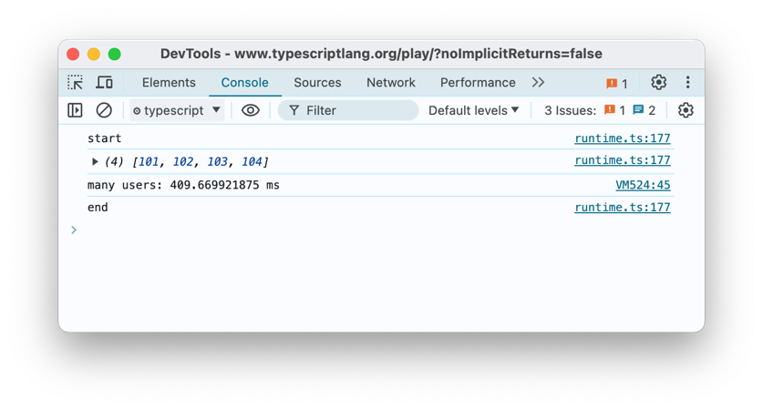
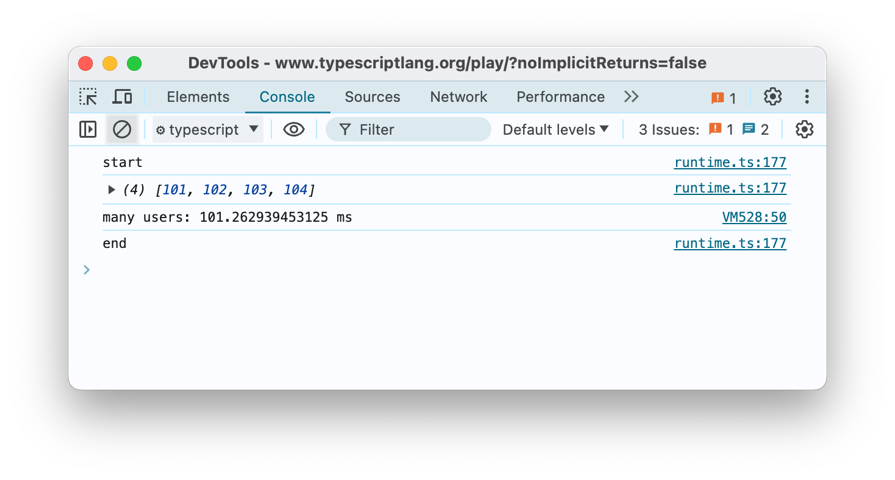

# 6. Advanced Parts and Bad Parts of TypeScript

This chapter covers

- Using generics
- Avoiding enums and tuples
- Applying type narrowing
- Avoiding pitfalls of asynchronous coding

Welcome to the labyrinthine world of TypeScript, where we navigate the twisty passages of advanced features and dodge the occasional goblin of common pitfalls! This chapter, while serving as your guide to the shadowy depths of generics, enums, tuples, and the mystical arts of async coding, is not your average, dry technical manual. Instead, it promises the thrills of an adventure novel, the chuckles of a late-night comedy show, and maybe, just maybe, the wisdom of a wise old sage (who knows a lot about software).

Now, let's crack the spine of this chapter with a bit of humor: Why do programmers prefer dark mode? Because light attracts bugs! And speaking of bugs, TypeScript generics are like the bug spray for your code. They keep the type-checking mosquitoes at bay, ensuring that your code is as reusable and adaptable as a Swiss Army knife—without the risk of cutting yourself on edge cases.

Generics are the heroes of this tale, wielding the power of type safety like a sword that can morph to match any enemy—er, data type. Imagine a function so versatile that it could handle any type thrown into the mix; a shape-shifter that adapts to strings, numbers, or even complex objects. This isn't just fantasy—it's the power of generics! For example, let’s talk about a simple, yet powerful generic function:

```typescript
function identity<T>(arg: T): T {
  return arg;
}
```

Here, `T` is not just a letter, but a placeholder for any type you wish to pass. It’s like telling your function, “Be prepared, something wild this way comes... but no worries, you got this!” You could then summon this function into action with any type, from a humble string to a union of command-line user roles:

```typescript
let output = identity<string>("Behold the mighty string!");
let userRole = identity<"admin" | "user">("admin");
```

Moving on from the battlegrounds of generics to the shady corners of avoiding enums and tuples—sometimes, it’s not about what you use, but what you wisely choose to avoid. While enums and tuples have their place, like that old sword you keep above the fireplace, there are times when simpler constructs such as union types might serve you better, offering clarity without the overhead.

And what about async coding? It's like the dark arts of the programming world; powerful, yet fraught with peril if not handled with care. We’ve all faced the dreaded beast of unhandled promise rejections, a common blunder that can crash your application like a poorly constructed spell. Here's how you might invoke an async function with all the due precautions:

```typescript
async function fetchData(url: string): Promise<void> {
  try {
    const response = await fetch(url);
    const data = await response.json();
    console.log("Eureka! Data retrieved:", data);
  } catch (error) {
    console.error("Alas! An error occurred:", error);
  }
}
```

As we tread further into this chapter, remember: the path of a TypeScript developer is filled with choices. Choose wisely, *padawan*, whether you're summoning generics into existence, opting out of enums, or dabbling in the async-await incantations. May the type safety be with you, and may your console.log always return true. So buckle up, get your coding gloves on (or wrist pads), and let's drive into the arcane world of TypeScript's advanced parts and the bad parts you ought to avoid—lest you want your code haunted by the ghosts of past bugs. 

## 6.1. Not Knowing Generic and Their Constraints

Now, you might be thinking, “Generics? Isn’t that just the cheap-knock-off store-branded version of JavaScript?” Close, but not quite. In TypeScript land, Generics are our secret weapon for writing code that’s reusable, adaptable, and strongly typed - basically the superhero of types! It’s like defining code but for a type that can be defined later. Generics for types are like arguments for functions. Before we dive in, here’s a little programming humor to lighten the mood: Why don’t programmers like nature? It has too many bugs!

TypeScript Generics is a feature that allows you to create reusable code components that work over a variety of types rather than a single one. In essence, generics offer a way to create “type variables”—placeholders for any type that the user provides when consuming the component.

For example, consider an array. An array can hold elements of any type, but once you create an instance of an array, you’d want it to work with a specific type, like string or number. Here’s how you might define a simple generic function:

```typescript
function identity<T>(arg: T): T {
  return arg;
}
```

In this example, T is our type variable. We use it as a placeholder for whatever type will be passed to the identity function when it’s called. It’s a way of saying, *“I don’t know what type we’ll be working with, but I promise it will be consistent.”*

You could then use the function with a specific type, like so with the string type:

```typescript
let output = identity<string>("myString");
```

Or like so with the union:

```typescript
let output = identity<"admin" | "user">("admin");
```

In this case, we’re specifying that we want to use the identity function with the type string. TypeScript will then enforce that the argument and return value are of type string.

I> It's worth noting that in real life (and code), it's unusual to specify explicitly type parameters like `identity<string>("myString")`. If we just write, `identity("myString")`, TypeScript will infer the type T as a string type (T=string). It's okay to specify the parameter to be more explicit about what's going on and to have extra safety in case the "myString" parameter to the function is actually not a string at all.

Generics allow for much more flexibility in TypeScript code, while still maintaining type safety. They’re a powerful tool for creating reusable components and can be used with functions, classes, interfaces, and more.

Let’s delve into more advanced examples of generics. As we’ve seen before, a generic function uses a type variable as a placeholder for its arguments and return type. Here’s an example of a generic function that takes two arguments of the same type:

```typescript
function pair<T>(a: T, b: T): [T, T] {  // tuple [T, T]
  return [a, b];
}

let pairOfNumbers = pair(1, 2); // has type [number, number]
let pairOfStrings = pair("hello", "world"); // has type [string, string]
```

{blurb, class: information}
In TypeScript, a tuple is a type that allows you to express an array with a fixed number of elements whose types are known, but need not be the same. Tuples are useful when you need to store a collection of values of varied types in a single variable and maintain the order and the specific type of each element. We can specify each element's type in a tuple. Here is an example of a tuple that holds a string and a number: 

```typescript
let person: [string, number]; 
person = ["Arun", 25]; 
```

The elements of a tuple can be accessed using their index, similar to an array: `console.log(person[0]);` will output Arun. Tuples are usually useful when we want a function to return multiple values of different types and we don't want to use an object for that. Thus, Tuples in TypeScript are a useful convenient feature for cases where we need to group together a few closely related values while maintaining their different types and the sequence they are in.
{/blurb}

It's worth calling out that in the statement let pairOfNumbers = pair(1,2); we relied on the TypeScript type inference. As mentioned prior, it's okay depending on the need to be explicit or not.

We can also create a generic class. In this example, we create a simple,
generic Stack class that has a private property elements and methods push and pop:

```typescript
class Stack<T> {
  private elements: T[] = []; 
  push(element: T) {
    this.elements.push(element);
  }

  pop(): T | undefined {
    return this.elements.pop();
  }
}
```

When we use this class, we have a type safety that will make sure to error when push is passed a wrong argument:

```typescript
let numberStack = new Stack<number>(); 

numberStack.push(1); // OK because generic type parameter (type parameter) is a number
numberStack.push("2"); // Error: Argument of type 'string' is not assignable to parameter of type 'number'.

let stringStack = new Stack<string>(); 
stringStack.push("hello"); // OK because generic is string

stringStack.push(1); // Error: Argument of type 'number' is not assignable to parameter of type 'string'.
```

While you can use generics in both functions and methods, they behave differently and cannot be interchanged directly. Consider the following example in which MyClass is a generic class and myFunction is a generic function:

```typescript
class MyClass<T> {
  data: T; 
  constructor(data: T) {
    this.data = data;
  }

  getData(): T {
    // method
    return this.data;
  }
}

function myFunction<T>(data: T): T {
  // function
  return data;
}
```

Even though they both use the generic type parameter T, the scope and use of T differ significantly. In MyClass, T is scoped to the class and is available throughout it. As a guideline, if we can, we try to bring generic declaration closer to its usage so if you only need T in a method of a class, just bring it to the method:

```typescript
class MyClass {
  getData<T>(): T {
    // method
    return this.data;
  }
}
```

On the other hand, in myFunction, T is only scoped to the function. Attempting to use T outside its scope leads to an error as T is not in scope:

```typescript
function anotherFunction(data: T): T {
  return data;
}
```

To avoid this confusion, always ensure that you define your type parameters in the correct scope.

And finally, we can also define a generic interface. For example, this KeyValuePair interface has key and value properties set to generics types K and V:

```typescript
interface KeyValuePair<K, V> {
  key: K; 
  value: V;
}
```

When we use this interface, we can have various combinations of K and V and TypeScript will enforce our types (note that we can also omit explicit generic type parameters):

```typescript
const kv1: KeyValuePair<number, string> = { key: 1, value: "Steve" }; // OK
const kv2: KeyValuePair<string, number> = { key: "test", value: 1 }; // OK
const kv3: KeyValuePair<string, string> = { key: "test", value: 123 }; // Error: Type 'number' is not assignable to type 'string'.
```

And as long as we are on the topic of interfaces, here’s a good joke. How many TypeScript programmers does it take to change a light bulb? — None. That’s a hardware issue, but they can create an interface for it!

Sometimes you might want to limit the types that can be used with your generic class. This can be done with generic constraints, but forgetting to use them when needed can lead to issues.

```typescript
class MyClass<T> {
  private data: T;

  constructor(data: T) {
    this.data = data;
  }

  printDataLength() {
    console.log(this.data.length); // Error: Property 'length' does not exist on type 'T'.
  }
}
```

Here, we’re trying to use the length property of data, but TypeScript doesn’t know if T has a length property. We should use a constraint to ensure T has length:

```typescript
class MyClass<T extends { length: number }> {
  private data: T;

  constructor(data: T) {
    this.data = data;
  }

  printDataLength() {
    console.log(this.data.length); // No error
  }
}
```

By using the { length: number } constraint, we ensure that T always has a length property.

In summary, when implementing generic classes, remember to use type parameters consistently, ensure that all methods are also generic, and use constraints when you need to limit the types that can be used. This will help you avoid common pitfalls and make your code safer and easier to understand.

## 6.2. Overusing Generics in Functions

Another common mistake, on the opposite spectrum of not using type parameters for functions, is the overuse of generics where they are not needed. Overusing generics can make your code hard to read and understand.

Type parameters are fundamentally designed to create relationships between the types of various values within a function. When a type parameter is utilized only once in the function signature, it fails to establish any relationship.

**Guideline**: If a type parameter is used in just a single location within the function signature, you should seriously reevaluate its necessity. Often, such solitary type parameters might be redundant and can complicate rather than simplify your function's design. By limiting the use of unnecessary type parameters, you ensure that your code remains clean, more maintainable, and easier to understand. This practice also enhances type inference, allowing TypeScript to more effectively deduce types, thereby improving the developer experience. When defining generic functions, aim for clarity and efficiency by using type parameters that genuinely enhance the functionality and interactivity of different data types within your function.

Let's delve into the concept of a mirror function to illustrate the use of generics:

```typescript
function mirror<T>(item: T): T {
  return item;
}
```

Is this a proper application of generics? In this instance, the generic argument, `T`, is used twice following its introduction:

```typescript
function mirror<T>(item: T): T {
  // (dec) 1 2
  return item;
}
```

This fulfills the criteria for effective use of generics. It appropriately connects two types, indicating that the type of the input parameter matches the return type.

Consider the following function:

```typescript
function selectThird<X, Y, Z>(first: X, second: Y, third: Z): Z {
  return third;
}
```

Here, the generic parameter `Z` is used appropriately, appearing twice. However, `X` and `Y` are used only once (beyond their declarations), suggesting an inefficiency in their usage. The function can be simplified to use just one generic parameter:

```typescript
function selectThird<Z>(first: unknown, second: unknown, third: Z): Z {
  return third;
}
```

Next, let’s look at a function designed to parse JSON data:

```typescript
function parseJSON<T>(data: string): T {
  // ...
}
```

Is this a beneficial or detrimental use of generics? The type parameter `T` appears only once, raising concerns. Such "return-only generics"
are risky because they effectively equate to any type, albeit without explicitly using the keyword `any`:

```typescript
interface Mass {
  kilograms: number; 
  grams: number;
}

const mass: Mass = parseJSON("");
```

In this code, `Mass` could represent any type, and it would still type check. If this flexibility is your intention, you might as well specify the type as `any`:

```typescript
function parseJSON(data: string): any {
  // ...
}
```

However, a more prudent approach would be to return `unknown`:

```typescript
function parseJSON(data: string): unknown {
  // ...
}
```

This requires users of the function to assert the type of the result explicitly:

```typescript
const mass = parseJSON("") as Mass;
```

This practice is beneficial as it compels you to be explicit about your type assumptions, removing any false sense of type safety.

Let's explore another example of generic usage in TypeScript with the following function:

```typescript
function displayValue<T, U extends keyof T>(entity: T, property: U) {
  console.log(entity[property]);
}
```

In this case, the generic `U` is only used once, which may not be the most effective use of generics since `T` appears both as a parameter type and as a constraint on `U`. A more streamlined approach would be to incorporate the `keyof T` directly into the parameter type and eliminate `U`:

```typescript
function displayValue<T>(entity: T, property: keyof T) {
  console.log(entity[property]);
}
```

This version simplifies the function by removing an unnecessary generic type, making the function easier to understand and maintain.

Now, consider a slightly different function:

```typescript
function fetchProperty<T, U extends keyof T>(entity: T, property: U) {
  return entity[property];
}
```

This function is a solid example of good generic usage. The magic here is evident when considering the function’s return type. When you check the function signature in an IDE, you'll see its complete type is:

```typescript
function fetchProperty<T, U extends keyof T>(entity: T, property: U): T[U];
```

The return type is `T[U]`, meaning that `U` is utilized effectively twice, not just for fetching the property but also for defining the return type. This ensures that the function maintains a strict relationship between the property key and its value, preserving type safety throughout the operation.

It's important to understand the effective usage of generics. These examples illustrate important principles for using TypeScript generics:

1. **Reduce Redundancy**: If a generic type does not serve a distinct purpose or improve type relationships within a function,
   reconsider its usage. Simplifying the function signature not only improves readability but also enhances code maintainability.

2. **Maintain Type Relationships**: Effective generics ensure that there is a meaningful relationship between types. For instance, linking a property key to its value in an object helps maintain type safety,
   making the code more predictable and robust.

3. **Facilitate Type Inference**: Properly used generics can aid TypeScript's type inference capabilities, making the developer's experience smoother and reducing the likelihood of runtime errors.

By adhering to these principles, developers can leverage TypeScript's powerful type system to write clearer, more effective code.

Writing generic functions is enjoyable, and it's easy to overuse type parameters. Excessive type parameters or unnecessary constraints can hinder type inference, leading to frustration for those using your function.

## 6.3. Failing to Use Generic Utility Types Pick and Partial

TypeScript has a robust system for dealing with types in a dynamic and adaptable way, called generic utility types. These are a set of generic interfaces provided by TypeScript that can be used to manipulate types. Not taking advantage of these can lead to repetitive code, more verbose code, missed opportunities for type safety, and can make it harder to correctly type more complex structures or operations. Two of these utility types are Partial and Pick.

The Partial<Type> type makes all properties of Type optional. In the following code Partial<Todo> is used for the type fieldsToUpdate. This allows us to provide an object with any subset of the properties of a Todo. Thus, Partial<Todo> makes all properties of Todo optional.

```typescript
interface Todo {
  title: string; 
  description: string;
}

function updateTodo(todo: Todo, fieldsToUpdate: Partial<Todo>) {
  return { ...todo, ...fieldsToUpdate };
}
```

And Pick<Type, Keys>: Allows you to create a new type by picking a set of properties Keys from Type.

```typescript
type TodoPreview = Pick<Todo, "title">;
```

In this example, Pick<Todo, 'title'> creates a new type TodoPreview that only includes the title property from Todo. This method is very convenient in Object-Relational Mapping libraries and API responses where we need to return only some properties and not the entire object.

Consider the following code in which we declare an interface type Person, function to log info and then use them:

```typescript
interface Person {
  name: string; 
  age: number; 
  address: string;
}

function logPersonNameAndAge(person: Person) {
  console.log(person.name, person.age);
}

const person: Person = { name: "Alice", age: 25, address: "Wonderland" }; 
logPersonNameAndAge(person);
```

In this example, logPersonNameAndAge doesn’t care about the address field in Person, it only needs name and age, but we’re forced to provide all three properties (name, age and address) when calling the function. We can use the Pick utility type to make this function just use the necessary data:

```typescript
function logPersonNameAndAge(person: Pick<Person, "name" | "age">) {
  console.log(person.name, person.age);
}

const person = { name: "Alice", age: 25 }; 
logPersonNameAndAge(person); // This now works without `address`
```

In this revised example, logPersonNameAndAge now accepts an object that just needs to have name and age. Thus, we don’t have to provide unnecessary fields when calling this function. This approach with Pick is more correct (principle of least privilege) and also more convenient when you don't have that address.

Now, moving to Partial. Here a mistake of not using it can lead to _reimplementing_ the types (functionality) that could be achieved with utility types. This can lead to more verbose and harder to maintain code. Ouch!

For example, consider this type where all fields of Person are optional:

```typescript
type OptionalPerson = {
  name?: string; 
  age?: number; 
  address?: string;
};

// ...rest of the code...
```

In this code, OptionalPerson is essentially a Person where all fields are optional. This is a common requirement, but implementing it manually is redundant because TypeScript provides the Partial utility type:

```typescript
type OptionalPerson = Partial<Person>; 
// ...rest of the code...
```

In this revised code, OptionalPerson is defined using Partial<Person>, which achieves the same result but is shorter and easier to understand. But most importantly, it will stay and get all the new changes from the Person type in the future (stay in "sync") as it changes.

In TypeScript, Generic Utility Types Pick and Partial are a set of predefined types that can be used to perform transformations on other types. These utility types can help to simplify and make your type definitions more expressive. Neglecting to use them when appropriate can lead to unnecessary code verbosity, duplication, and potential type errors. By taking advantage of generic utility types such as Pick and Partial, we can write TypeScript code that is more concise, easier to understand, and more flexible.

## 6.4. Not Understanding Conditional Types in Generics

In TypeScript, conditional generic types allow you to define types that change based on the conditions applied to their parameters. These types can be particularly powerful in scenarios where you need to enforce specific type relationships dynamically based on the input types. Here's an example to illustrate how you can use conditional generic types in a practical scenario:

We'll start with a basic example of conditional generic types. Suppose you want to create a utility type that checks if a type extends a `number`, and based on that condition, it either transforms the type to a `string` or keeps it unchanged. Here's how you might define and use such a conditional type:

```typescript
type NumberToString<T> = T extends number ? string : T;

// Usage
type A = NumberToString<number>; // A is string
type B = NumberToString<string>; // B is string
```

In this example, `NumberToString` checks if `T` is a subtype of `number`. If `T` is `number`, it resolves to `string`; otherwise, it resolves to the original type `T`.

Let's create a more practical example where a function returns different types based on its input parameter's type. This function, `wrapValue`, will return an object containing either a `string` representation of the value if it's a `number` or the value itself if it's any other type.

```typescript
type WrapType<T> = T extends number ? { type: "number"; value: string } : { type: "other"; value: T };

function wrapValue<T>(value: T): WrapType<T> {
  if (typeof value === "number") {
    return { type: "number", value: value.toString() } as WrapType<T>;
  } else {
    return { type: "other", value: value } as WrapType<T>;
  }
}

// Example usages
const wrappedNumber = wrapValue(10); // Type is { type: 'number'; value: string; }
const wrappedString = wrapValue("hello"); // Type is { type: 'other'; value: string; }

console.log(wrappedNumber); 
console.log(wrappedString);
```

In this example:

- `WrapType<T>` uses a conditional type to determine the structure of the return type based on whether `T` is a `number`.
- The `wrapValue` function checks the runtime type of `value` and constructs the return object accordingly.
- TypeScript correctly infers the type of the return value based on the input type, demonstrating how conditional types can dynamically influence the flow of types through your program.

Conditional generic types are a robust feature in TypeScript that allows developers to write more type-safe and flexible code by dynamically adjusting types based on the conditions applied to them.

In TypeScript, the `extends` keyword is indeed central to defining conditional types, but it's important to clarify that `extends` in this context doesn't function exactly like inheritance in traditional object-oriented programming. Instead, `extends` within a conditional type acts as a type constraint that checks if a type can be assigned to another, serving as a conditional check rather than denoting extension or inheritance.

Next, let's dive into `extends` conditional types. The `extends` keyword is used in TypeScript's conditional types to evaluate a condition that resembles an "if-else" structure. Here’s the syntax:

```typescript
type ConditionalType = TypeA extends TypeB ? TypeC : TypeD;
```

In this syntax:

- `TypeA` and `TypeB` are types.

- `TypeA extends TypeB` checks whether `TypeA` can be assigned to `TypeB`.

- If `TypeA` is assignable to `TypeB`, the conditional type resolves to `TypeC`.

- If not, it resolves to `TypeD`.

Are there other conditional operators? While TypeScript doesn't have other "conditional operators" in the way that `extends` is used in conditional types, the language does support other operators and techniques for creating sophisticated type behaviors:

- **Mapped types**: These allow you to create new types by transforming properties of an existing type in a way that can depend on the properties' keys and values.

- **Utility types**: TypeScript provides several built-in utility types (like `Partial<T>`, `Readonly<T>`, and `Pick<T, K>`) that modify types in various ways, which can sometimes achieve 'conditional' effects based on the input types.

- **Intersection and Union Types**: These can be used to combine multiple types either by intersecting them (`TypeA & TypeB`) or by allowing any one of several types (`TypeA | TypeB`).

Finally, let's take a look at an example of using combined type operations. Here's an example that shows how you might combine various type operations to create complex behaviors without using additional conditional operators:

```typescript
type Admin = {
  name: string; 
  privileges: string[];
};

type User = {
  name: string; 
  email: string;
};

// Conditional type that checks the presence of 'privileges' property
type Staff<T> = T extends { privileges: any[] } ? Admin : User;

// Using a mapped type within a conditional expression
type Optional<T> = {
  [P in keyof T]?: T[P];
};

type OptionalAdmin = Optional<Staff<Admin>>; // Partial properties;

type OptionalUser = Optional<Staff<User>>; // Partial properties;

// Union type that allows function to accept either type
function setupProfile(user: Admin | User) {
  // Function implementation
}
```

In summary, while `extends` is the primary tool for creating conditional types in TypeScript, the language's type system offers a rich set of tools for manipulating types that, when combined, can mimic various conditional behaviors and create highly dynamic type conditions.

## 6.5. Using Enums Instead of Union Types

Sometimes, it’s easier to use a union type instead of an enum. Here’s an example where an enum is not needed:

```typescript
enum Color {
  Red,
  Green,
  Blue,
}
function paint(color: Color) {
  // ...
}
paint(Color.Red);
```

Instead, a union type can simplify the code:

```typescript
type Color = "Red" | "Green" | "Blue";
function paint(color: Color) {
  // ...
}

paint("Red");
```

It’s simpler and doesn’t add unnecessary symbols to the runtime JavaScript. Moreover, some TypeScript gurus like Dan, the author of Effective TypeScript, would even say enums are a bad part of TypeScript (analogous to the famous book JavaScript The Good Parts). Why is that?
It can give you a false sense of type safety. Consider this example with the same Color enum:

```typescript
enum Color {
  Red,
  Green,
  Blue,
}

let c: Color;

c = 1; // ok
console.log(Color[c]); // Green
c = 2 + 10; // ok
console.log(Color[c]); // undefined
```

Generally, I recommend using unions unless you have to use enums. This is because there are several reasons why one might opt for a union type instead of an enum in specific circumstances:

- Simplicity and Readability: Union types often offer simpler, more JavaScript-like syntax than enums. They allow you to directly use the values you care about (‘Car’, ‘Truck’, etc.), instead of referencing them through an enum (VehicleType.Car, VehicleType.Truck, etc.). This can make the code more readable, especially after TypeScript is transpiled to JavaScript.

- String-based Values: If your set of constants is string-based, using a union type can make your code align more closely with the actual values used. When an enum is transpiled to JavaScript, the values become numbers, which can be less meaningful. On the other hand, a string-based union type retains its values, making the JavaScript output more understandable.

- Flexibility: Union types can be more flexible than enums, as they can represent any kind of type, not just numeric or string values. For example, a union type could be used to represent a value that can be either a number or a specific string.

- Smaller JavaScript Output and Performance Hit: Enums are a TypeScript feature that does not exist in JavaScript, and TypeScript simulates them by generating additional code. This can lead to larger JavaScript output, especially if you have many enums. Union types, on the other hand, leverage existing JavaScript constructs and don’t add any extra code to your JavaScript output.

- Use with External Libraries or APIs: When working with JavaScript libraries or external APIs, you are likely dealing with raw values (often strings). In this case, using union types can be more convenient and less error prone as you don’t need to map raw values to the corresponding enum members.

It’s worth noting that enums can still be a great choice when you have a large set of related constants, especially if you need to iterate over them, or when the auto-incrementing behavior of numeric enums is useful.

I> If you are not familiar with enums, short for enumerations, are a feature in TypeScript that allows us to define a set of named constants. They are a way of giving more friendly and consistent (from the word const) names to sets of numeric or string values. Thus, enums, or enumerations, are a special type that consists of a set of named constants. It’s like declaring “Monday” as 1, “Tuesday” as 2… but let’s be honest, we’d all rather declare “Monday” as “still-weekend”, wouldn’t we?

In TypeScript, an enum is a special type used to define a collection of related values. This can be numeric or string values.

Let’s see a basic numeric enum:

```typescript
enum Direction {
  Up,
  Down,
  Left,
  Right,
}
```

By default, enum numbering starts at 0. So, Direction.Up would be 0, Direction.Down would be 1, and so on. You can also manually assign values to the enum members. For example:

```typescript
enum Direction {
  Up = 1,
  Down,
  Left,
  Right,
}
```

In this case, Direction.Up would be 1, Direction.Down would be 2, and so on. TypeScript will automatically increment the following members by 1.

TypeScript also supports string enums, where we give a string value to the members:

```typescript
enum Direction {
  Up = "UP",
  Down = "DOWN",
  Left = "LEFT",
  Right = "RIGHT",
}
```

In this case, Direction.Up would be “UP”, Direction.Down would be “DOWN”, and so on.

Now, how does TypeScript translate enums to JavaScript? Let’s take our first numeric enum example and see what TypeScript generates:

```typescript
var Direction;

(function (Direction) {
  Direction[(Direction["Up"] = 0)] = "Up";
  Direction[(Direction["Down"] = 1)] = "Down";
  Direction[(Direction["Left"] = 2)] = "Left";
  Direction[(Direction["Right"] = 3)] = "Right";
})(Direction || (Direction = {}));
```

As you can see, TypeScript generates a self-invoked function which populates an object with our enum members. It makes the enum members available in both directions: you can get the string name from the numeric value, and you can get the numeric value from the string name.

JavaScript does not have built-in support for enums, but they can be emulated using an object, as TypeScript does when it compiles enum types to JavaScript.

The TypeScript enums provide type safety (sometimes) and autocompletion, which can make our code less error-prone and easier to understand. But remember, because enums become objects in JavaScript, they add an extra layer of abstraction and extra code to your final JavaScript bundle. If performance is a critical aspect of your project, you might want to use simple constants or other type-safe alternatives like union types.

## 6.6. Not replacing tuples with objects when possible

Tuples are a powerful tool in TypeScript for representing a fixed number of elements of potentially different types. However, they can be misused when they are used in place of a more semantically meaningful construct. Let’s explore this in more detail.

Consider the following example of misuse in which we have tuple userInfo to store ID and name:

```typescript
let userInfo: [number, string] = [12, "Alejandro Gabriel Torres Garcia"];
console.log(userInfo[0]); // Output: 12
```

This code snippet works, and we have a tuple named userInfo that represents user information. But it’s not clear what userInfo[0] and userInfo[1] mean. They can be ID, name, superhero status and so on. The code lacks context and readability. A better solution is to use an object:

```typescript
let userInfo = {
  id: 12,
  name: "Alejandro Gabriel Torres Garcia",
};
console.log(userInfo.id); // Output: 12
```

This code is easier to read and understand. By using an object, we provide meaningful property names (id and name) that make it clear what each value represents. This improves the readability and maintainability of the code, especially as the complexity of the data structure grows.

Using objects instead of tuples allows us to have better code readability (for human readers). We can define interfaces or types to enforce the structure of the object, provide autocomplete suggestions, and perform type-checking:

```typescript
interface UserInfo {
  id: number;
  name: string;
}

let userInfo: UserInfo = {
  id: 1,
  name: "Alejandro Gabriel Torres Garcia",
};

console.log(userInfo.id); // Output: 1
```

With an interface or type definition, we have a clearer contract for the shape of the object, making it easier for other developers to understand and use the code.

{blurb, class: information}
Tuples support labels for better readability. In TypeScript, tuple labels (also referred to as "labeled tuple elements") are a feature that enhances the readability and documentation of tuple types by allowing you to assign names to the elements of a tuple. These labels do not change the behavior of the tuple; they simply provide a way to document what each position in the tuple is intended to represent, making the code easier to understand. Here’s how you can define and use labeled tuples:

```typescript
type Customer = [id: number, name: string, age: number];

let customer: Customer = [1, " Alejandro", 30]; // Corresponds to [id, name, age];

console.log(customer[1]); // Alejandro
```

In the example above, the tuple `Customer` is defined with labels for each element. The labels are `id`, `name`, and `age` corresponding to a `number`, `string`, and `another number` respectively.
{/blurb}

Consider a function that returns a tuple representing a response from an API. Using labels can clarify the meaning of each element of the tuple:

```typescript
function fetchUserData(): [status: number, body: string] {
  // Imagine this function makes an API call and returns status and body
  return [200, '{"name":"Alice", "age":30}'];
}

const [statusCode, responseBody] = fetchUserData();

console.log(statusCode); // 200
console.log(responseBody); // '{"name":"Alice", "age":30}'
```

In this function, `fetchUserData` returns a tuple with two labeled elements. The use of labels `status` and `body` makes it clear what each part of the tuple contains, enhancing the readability of the destructuring line and the subsequent usage. While tuple labels do not impact the functionality of the tuple, they are a powerful tool for making code more understandable and maintainable. As such, they are especially useful in complex systems where clarity of data structure and intent is paramount.

While personally I recommend just using objects and consider tuples as a bad part of TypeScript, you'll still encounter tuples in other people's code, if you work long enough with TypeScript. Let's try to see the differences in TypeScript between tuples and objects and see if they are truly two different data structures that serve distinct purposes (or one needs to go, looking at you, tuples!). Here’s a comparison between tuples and objects (understanding their differences and use cases is important for effective TypeScript development):

Tuples:

- Tuples are ordered collections of elements with different types. Each element in a tuple can have its own type, and the order of elements is fixed.

- Tuple types are defined using square brackets [] and separate the types of elements with commas.

- Tuples are okay when you want to represent a collection of values where the order and the types of elements matter. For example, representing coordinates (x, y) or a getStats function that returns average and count.

- Tuple elements can be accessed using numeric indices, starting from 0.

- Tuples have a fixed length, and the type system enforces the expected number of elements in a tuple.

- Tuples are often used when working with functions that need to accept or return multiple values of different types.

- Tuples don't provide description of the values in the JavaScript code even with tuple labels. When we define a tuple type with labels, we specify a name for each element along with its type. They help with code readability but only in the TypeScript code (not in the generated JavaScript code).

Objects:

- Objects are unordered collections of key-value pairs. Each value in an object can have its own type, and the order of properties is not guaranteed.

- Object types are defined using curly braces {} and specify the types of properties along with their names.

- Objects are suitable when you want to represent structured data where the association between keys and values is important. For example, representing a person’s information with properties like name, age, and address.

- Object properties can be accessed using their names (keys) using the dot notation (object.property) or square bracket notation (object['property']).

- Objects can have dynamic properties, meaning that you can add or remove properties during runtime.

- Objects are often used when working with APIs, JSON data, or when modeling complex entities with various properties.

In summary, tuples are used when the order of elements and their types matter, while objects are used for unordered collections of key-value pairs. Choosing between tuples and objects depends on the specific requirements and structure of the data you need to represent.

While tuples have their use cases, it’s important to consider whether they are the most appropriate choice. When working with structured data, using objects with well-defined properties can greatly enhance code clarity, maintainability, and leverage TypeScript’s type system effectively.

## 6.7. Not Knowing Various Type Narrowing Techniques

Now please take a moment to think about how it feels to be a TypeScript developer. One day you’re soaring through the clouds, declaring types with the precision of a ballet dancer performing a grand jeté, and the next you’re sinking in quicksand, tangled in a web of undefined variables and union types as mixed up as a sushi pizza.

You look down, and there it is—a warning. An angry, red underline shouting at you, “I’m sorry, but you can’t just ‘assume’ I’m going to be this type!” Like an argumentative toddler with a newfound obsession for the word “no,” TypeScript can sometimes seem more like a stubborn barrier than a helpful guide. But what if we told you there is a way to transform that rigid, stubborn TypeScript into a docile, cooperative ally? Enter Type Guards and Type Narrowing, the twin lifeguards of TypeScript Malibu beach.

These smart type guards can distinguish between "pizza" and "sushi" in your union type Dinner, so your function won’t accidentally drizzle soy sauce on your Margherita. (Although this sounds like it... might be tasty after all?! Now, I'm tempted to try!) They can tell a Fish from a Bird, ensuring that your swim() function doesn’t end up with a flapping sparrow. It’s like having a pair of glasses that can see into the heart of your code and identify the real essence of your types.

The type guards ask the hard questions like, “is this variable REALLY a number?” or “are you absolutely SURE this object is an instance of Student class?” - putting your code through the trial by fire before it dares to take that leap of faith.

```typescript
const { pageCount } = request.data;

import student from "@repo/seeders";

//...

// param could be pageCount or student?!

if (typeof param === "number") {
  // TypeScript now knows it's a number so we can pass it as-is to the database query
}

if (typeof param === "object") {
  // It's an object, not a number!
}
```

With type guards, we can avoid a lot of run-time errors. Ah, the joy of programming in a world where type-checking errors have been banished to the farthest reaches of the void! Hold on tight, and remember—in the world of TypeScript, things aren’t always what they typeof! We are going to cover several techniques:

- if/else conditions right in the code
- type predicate functions, a.k.a., custom type guards

With all them, we typically would check the type using one of the following methods (or a combination of them):

- `typeof`
- `instanceof`

- equality especially for with literals and null and undefined checks
- the `in` operator to check for presence (existence) of properties and methods on objects
- discriminated unions: checks on a common property
  Let's take a look at these main techniques for type narrowing in TypeScript one by one.

`typeof` guard: Useful for primitives like `string`, `number`,
`boolean`, and `function`.

```typescript
function padLeft(padding: number | string, input: string) {
  if (typeof padding === "number") {
    return new Array(padding + 1).join(" ") + input;
  }
  return padding + input;
}

console.log(padLeft(10, "hello world")); // Output: " hello world"
console.log(padLeft(".....", "hello world")); // Output: ".....hello world"
```

Ah, the typeof operator. At times, it’s your best friend in TypeScript, serving as a helpful guide when traversing the labyrinth of data types. But other times, it’s a sneaky trickster that can lead you into traps, leaving you knee-deep in type errors and confusion. So, let’s unravel the mystery behind the misuse of the typeof operator.

Let me provide a little context on typeof in TypeScript (and JavaScript). We use the typeof operator to get the type of a variable, property or value. This operator returns a string representing the type. For instance,

```typescript
console.log(typeof "Hello World"); // Outputs: "string"
console.log(typeof 42); // Outputs: "number"
console.log(typeof true); // Outputs: "boolean"
console.log(typeof undefined); // Outputs: "undefined"
```

It looks simple and handy, doesn’t it? It certainly is… for _primitive_ types. However, the typeof operator is not always so straightforward.
When we try to use typeof with the following types, it gets tricky:

- User-defined types and interfaces
- Null values
- Arrays
- Functions
  In the case of user-defined types and interfaces, the typeof operator falls short. This is because typeof is a JavaScript construct that survived its way into TypeScript. It's really common to other languages as well to have old ugly bad parts migrate into new versions due to requirements of backwards compatibility (Java 21 is another example that has some archaic structures not present in more modern Kotlin). So typeof is a JavaScript thing and it really cannot do much with user-defined type or interfaces.

Consider the next snippet that defines the interface Student with name and age, then creates an instance of this student type only to have typeof return a generic object:

```typescript
interface Student {
  name: string;
  age: number;
}

let alena: Student = { name: "Alena", age: 21 };
console.log(typeof alena); // Outputs: "object", not "Student"
```

Here, even though alena is of type Student, typeof operator returns “object”. It can’t distinguish between custom types or tell you when you’re dealing with a specific interface. This can lead to type errors if you’re expecting “Student”. To mitigate this problem, we have to use one of the type guard techniques covered in the previous section of this chapter, like instanceof, "in" or discriminated unions.

Another pitfall of the typeof operator is how it deals with null values.

```typescript
let something = null;
console.log(typeof something); // Outputs: "object", not "null"
```

While null is considered a primitive type, typeof null confusingly returns “object”. This can create confusion and lead to potential errors if not handled correctly. To avoid this pitfall, simply use strict-check (triple equals) comparison: something === null.

Next is dealing with arrays and functions. While technically correct, typeof returns “object” for arrays and “function” for functions, which might not be the granularity you’re looking for.

```typescript
console.log(typeof [1, 2, 3]); // Outputs: "object"
// Function factory for defining an object 'Person'
function Person(name: string, age: number) {
  return {
    name: name,
    age: age,
    sayHello: function () {
      console.log(`Hello, my name is ${this.name} and I am ${this.age} years old.`);
    },
  };
}

console.log(typeof Person); // Outputs: "function"
```

By the way, the same typeof output function happens with class which is probably not what we expected:

```typescript
class Person {
  name: string;
  age: number;

  constructor(name: string, age: number) {
    this.name = name;
    this.age = age;
  }

  sayHello() {
    console.log(`Hello, my name is ${this.name} and I am ${this.age} years old.`);
  }
}

console.log(typeof Person); // Outputs: "function"
```

If you are new to JavaScript you may be surprised to see that array is an object (which is a hashmap really) while class is a function. What the heck you may say?! JavaScript are you drunk? Well, maybe but that's another story how the first version was developed in 11 days in 1995 and almost all the bad parts still stuck to this day. Anyway, back to the types.

We get the object type for an array, because under the hood, type array is a special type of object (associative) in JavaScript. And as far as functions are concerned, JavaScript classes are not really classes but syntactic sugar for functions that create prototypal inheritance. Also, JavaScript treats functions as first-class objects, granting them the ability to be passed as arguments to other functions, returned from functions, and stored in variables and properties. Like regular objects, functions can possess properties and methods, but their distinctive feature lies in their invocable nature, allowing them to be called during the execution.

So we have what we have and to mitigate the shortfall of typeof with arrays and functions, we can use one of the following approaches all of which output true:

```typescript
const arr = [1, 2, 3];

console.log(Array.isArray(arr)); // good
console.log(arr instanceof Array); // good
console.log(arr.constructor === Array); // meh
console.log(Object.prototype.toString.call(arr) === "[object Array]");
// ugly
```

{blurb, class: information}
To check if a variable is a class (function), we can use this hack that uses a regular expansion to find keyword class in the text representation of the function under consideration:

```typescript
const isClass = (fn: Function) => /^s*class/.test(fn.toString());

class Person {
  name: string;
  age: number;

  constructor(name: string, age: number) {
    this.name = name;
    this.age = age;
  }

  sayHello() {
    console.log(`Hello, my name is ${this.name} and I am ${this.age} years old.`);
  }
}

console.log(isClass(Person)); // Outputs: true
```

Yes, it's not pretty and hacky but it can demonstrate the mighty powers and flexibility of JavaScript and TypeScript for that matter and luckily this need doesn't come up that often in JavaScript nor TypeScript.
{/blurb}

In summary, while the typeof operator is a powerful tool when used correctly, it has its limitations and quirks. Misusing it can lead to subtle bugs, type errors, and confusion. Understanding these pitfalls will help you use the typeof operator more effectively and write cleaner, less error-prone TypeScript code.

`instanceof` guard: Useful for narrowing types when dealing with class instances. For example, we have two classes Bird and Fish and need to use the same function move on both:

```typescript
class Bird {
  fly() {
    console.log("Flap Flap");
  }
}

class Fish {
  swim() {
    console.log("Slosh");
  }
}

function move(animal: Bird | Fish) {
  if (animal instanceof Bird) {
    animal.fly();
  } else {
    animal.swim();
  }
}
```

Checking for equality (like `===`, `!==`, `==`, `!=`) can also be used to narrow types, especially with literals and `null`/`undefined` checks.

```typescript
function processRequest(url: string | null) {
  if (url === null) {
    console.error("The URL is null.");
    return;
  }

  // TypeScript now knows `url` is a `string` not `null`.
  fetchData(url);
}
```

The `in` keyword checks for the existence of properties on objects and can be used as a type guard.

```typescript
type Fish = { swim: () => void };
type Bird = { fly: () => void };

function move(animal: Fish | Bird) {
  if ("swim" in animal) {
    animal.swim();
  } else {
    animal.fly();
  }
}
```

The usage will be like this with creating specific objects for pets of types Fish and Bird, and then using the same function move on both of them:

```typescript
const finDiesel: Fish = {
  swim() {
    console.log("Slosh");
  },
};

const wingstonChurchill: Bird = {
  fly() {
    console.log("Flap Flap");
  },
};

move(wingstonChurchill); // "Flap Flap"

move(finDiesel); // "Slosh"
```

Discriminated unions involve a common property (discriminant) shared across all members of the union. This property has literal types which TypeScript can use to narrow down the correct type.

```typescript
type Event = { kind: "click"; x: number; y: number } | { kind: "keypress"; key: string };

function handleEvent(event: Event) {
  if (event.kind === "click") {
    console.log(`Click at (${event.x}, ${event.y})`);
  } else {
    console.log(`Key pressed: ${event.key}`);
  }
}
```

I> The name discriminated unions has nothing to do with the unjust or prejudicial treatment of different categories of people. Instead it comes from the word "discriminant". In mathematics, the discriminant of a polynomial is a quantity that depends on the coefficients and allows deducing some properties of the roots without computing them.

So all these techniques can be used right in the function to narrow down the types, or they can be abstracted away into a separate functions for better code reuse (when you need this type guard more than one time). These special functions act as custom type guard functions or predicates because they use type predicate "is". Ergo, we can define custom type guards by writing functions that use a type predicate (`arg is Type`) as a return type:

```typescript
function isFish(animal: Fish | Bird): animal is Fish {
  return (animal as Fish).swim !== undefined;
}

function move(animal: Fish | Bird) {
  if (isFish(animal)) {
    animal.swim();
  } else {
    animal.fly();
  }
}

const finDiesel: Fish = {
  swim() {
    console.log("Slosh");
  },
};

const wingstonChurchill: Bird = {
  fly() {
    console.log("Flap Flap");
  },
};

move(wingstonChurchill); // "Flap Flap"
move(finDiesel); // "Slosh"
```

The example that we just saw works very similarly to our previous fish and bird example but of course with a big advantage that now we have a separate isFish function to invoke many times from different places. I usually put such functions in a shared library accessible from different parts of the projects or even different projects.

Somewhat related to type narrowing are two assertions: non-null assertion operator ! and the type assertion operator "as". The non-null assertion operator tells TypeScript that an expression is not null or undefined.

```typescript
function process(id: string | undefined) {
  const processedId = id!.trim(); // We are sure `id` is not `undefined` here.
}
```

Type assertions can be used to tell TypeScript you know more about the type than TypeScript itself does. It's basically the last resort method and one step from giving up and putting //ts-ignore or //ts-expect-error.

```typescript
let someValue: any = "this is a string";
let strLength: number = (someValue as string).length;
```

These techniques, among others, enable TypeScript developers to manage and manipulate types dynamically and safely, adhering closely to the application’s requirements for type correctness and safety.

## 6.8. Using Use of ‘instanceof’ With Non-Classes

As we delve deeper into TypeScript’s toolbox, we encounter the instanceof operator. A sentinel at the gate of classes, instanceof is a binary operator used to test whether an object is an instance of a class or not.

Yet, just like its cousin typeof, instanceof can bring forth puzzlement and strife if misused or misunderstood. Let’s unravel these tangled threads and explore the inappropriate use of instanceof in TypeScript.

Let me provide you with a touch of background on instanceof. The instanceof operator expects the left-hand operand to be an object and the right-hand operand to be a constructor function of a class. The code below demonstrates the usage of a simple class in TypeScript and illustrates the concept of instance and inheritance.

The code starts by defining a class named Cat. The Cat class has a single method called meow(), which logs “Meow!” to the console when called. After defining the Cat class, the code creates a new instance of the class using the new keyword. A new object kitty, which is an instance of the Cat class, is created with the new Cat() syntax based on the Cat class blueprint (a.k.a. prototypal inheritance).

Then, the code then checks whether the kitty object is an instance of the Cat class using the instanceof operator:

```typescript
class Cat {
  meow() {
    console.log("Meow!");
  }
}

let kitty = new Cat();
console.log(kitty instanceof Cat); // Outputs: true
```

The instanceof operator returns true if the left-hand operand (kitty in this case) is an instance of the right-hand operand (Cat in this case). Since we created the kitty object using the new Cat() syntax, it is indeed an instance of the Cat class. Therefore, the output of the console.log() statement will be true. All in all, kitty is an instance of Cat, and all is right in the world.

Now, let’s dive into some examples of when instanceof may lead you astray with the misuse cases and their consequences. First, we’ll cover Primitive types. The instanceof operator is used to determine whether an object is an instance of a certain class. If you try to use it with primitive types like numbers, strings, or booleans, it will always return false. And we also can get the error: “The left-hand side of an ‘instanceof’ expression must be of type ‘any’, an object type or a type parameter”:

```typescript
console.log("Hello World" instanceof String); // Outputs: false
console.log(42 instanceof Number); // Outputs: false
console.log(true instanceof Boolean); // Outputs: false
```

Even though the literals appear to match the type, instanceof returns false because these primitives are not instances of their respective wrapper classes (Number, String, Boolean). Interestingly, if we change primitives to wrapper objects instances, we’ll get true in all three statements:

````typescript
console.log(new String("Hello World") instanceof String); // Outputs: true;
console.log(new Number(42) instanceof Number); // Outputs: true
console.log(new Boolean(true) instanceof Boolean); // Outputs: true ```
````

Therefore, we need to be cautious when using instanceof with primitives.

{blurb, class: information}
Object wrappers in JavaScript (and by extension, TypeScript, which compiles to JavaScript) are special types of objects that wrap primitive values such as strings, numbers, and booleans. JavaScript provides constructor functions like String, Number, and Boolean that can be used to create object versions of primitives. These are distinct from the primitive values themselves. Here’s an example of using object wrappers.
In this example, strPrimitive is a primitive string, while strObject is an object that wraps the string.

```typescript
let strPrimitive = "hello";
let strObject = new String("hello");
console.log(typeof strPrimitive); // Outputs "string"
console.log(typeof strObject); // Outputs "object"
```

It is recommended to _avoid_ using object wrappers.
{/blurb}

Next, let’s talk about interfaces and custom types. The instanceof operator can only check whether an object is an instance of a class. It can’t check if an object adheres to an interface or a custom type. This is because interfaces and types exist only at compile time for static type checking and don’t have a presence at runtime. Let’s say we have an interface Dog with a method bark. That’s what dogs do, right? Then we try to determine the instance of the pet argument inside of the adoptPet function only to get an error “‘Dog’ only refers to a type, but is being used as a value here”:

```typescript
interface Dog {
  bark(): void;
}

function adoptPet(pet: Dog) {
  if (pet instanceof Dog) {
    // Error: 'Dog' only refers to a type, but is being used as a value here.
    console.log("Adopted a dog!");
  }
}
```

The code above will give you a compile error because you can’t use an interface with the instanceof operator. This is simply because interface does NOT exist at runtime. They are purely a TypeScript-time construct that gets stripped at compile time. The proper way is to check if pet is of a specific type. Thus, we need to create a class CaucasianShepherd that implements the interface Dog and then use the class in adoptPet:

```typescript
interface Dog {
  bark(): void;
}

class CaucasianShepherd implements Dog {
  bark() {
    console.log("woof woof");
  }
}

function adoptPet(pet: any) {
  if (pet instanceof CaucasianShepherd) {
    console.log("Adopted a dog!");
  } else {
    console.log("Adopted an alien");
  }
}

adoptPet(new CaucasianShepherd());
adoptPet(new Array(1, 2, 3));
```

If you still want to check if an object pet is adhering to the interface Dog, then we can use duck typing. For example, we can check for the bark method:

```typescript
interface Dog {
  bark(): void;
}

function adoptPet(pet: any) {
  if (typeof pet.bark === "function") {
    console.log("Adopted a dog!");
    pet.bark();
  }
}
```

{blurb, class: information}
"Duck typing" is a concept used in computer programming, particularly in dynamic languages like Python and JavaScript. It refers to a type system where the methods and properties of an object determine the validity of its semantics, rather than its inheritance from a particular class or implementation of a specific interface. Duck typing is also popular with Ruby, Groovy and Perl.

The name "duck typing" comes from the phrase, "If it looks like a duck, swims like a duck, and quacks like a duck, then it probably is a duck." In programming, this means that if an object can perform a task required by a function or a part of code, it can be used as an argument for that function or in that context, without having to be of a specific type.
{/blurb}

Finally, there’s a case of instances from different execution contexts. Another subtler trap with instanceof comes into play when dealing with objects from different JavaScript execution contexts (like iframes or worker threads). Each context has its own separate global environment, and hence its own set of constructor functions. An object from one context is not an instance of the constructor from another context even when they should be the same, e.g., Array and Array. This principle also applies to other JavaScript execution contexts such as Web Workers, Service Workers, or different Node.js modules. This is an important subtlety to remember when working with multiple JavaScript/TypeScript execution contexts in order to avoid surprising instanceof results.

The lesson? Treat instanceof like a bouncer for your class-based party. It can identify the guests (instances) who have the invitation (class constructor). However, it will be left confused when presented with party-crashers (primitive types) or incognito guests (interfaces). Understanding its strengths and weaknesses can help you avoid those sneaky, hard-to-spot bugs and keep the TypeScript party going!

## 6.9. Failing to Use Discriminated Unions

A discriminated union is a pattern in TypeScript that allows you to create a type that can be one of several different types, with a common field that can be used to determine which type it is. They can significantly improve the safety and ease of handling types that can vary in shape.

The mistake of “failing to use discriminated unions” comes when you’re dealing with such types, and you don’t take advantage of this powerful TypeScript feature. It can lead to more complex, harder to read and understand code, and it can also make it easier to introduce bugs, as you may forget to handle all possible types correctly.

Here’s a simple example to illustrate. Let’s say you have a function that takes an object that can either be a circle or a rectangle, and you want to calculate its area:

```typescript
type Circle = {
  radius: number;
};

type Rectangle = {
  width: number;
  height: number;
};

type Shape = Circle | Rectangle;

function getArea(shape: Shape) {
  if ("radius" in shape) {
    // circle
    return Math.PI * shape.radius ** 2;
  } else {
    // rectangle
    return shape.width * shape.height;
  }
}
```

This works, but it relies on checking for the presence of a radius property to distinguish between circles and rectangles (i.e., duck typing). If you later add another shape type with a radius property like cylinder, this function will give erroneous results, because the other shape has radius but needs a different formula:

```typescript
type Cylinder = {
  radius: number;
  height: number;
};

// ...

type Shape = Circle | Rectangle | Cylinder;

function getArea(shape: Shape) {
  if ("radius" in shape) {
    // could be a cylinder!
    // circle or cylinder???
    return Math.PI * shape.radius ** 2; // area of a circle
    // return Math.PI * shape.radius * (shape.radius + shape.height) //area of a cylinder
  } else {
    // rectangle
    return shape.width * shape.height;
  }
}
```

Instead of relying on radius property, we should just implement a discriminated union by adding property "kind" to distinguish the types of geometrical shapes:

```typescript
type Circle = {
  kind: "circle";
  radius: number;
};

type Rectangle = {
  kind: "rectangle";
  width: number;
  height: number;
};

type Cylinder = {
  kind: "cylinder";
  radius: number;
  height: number;
};

type Shape = Circle | Rectangle | Cylinder;

function getArea(shape: Shape) {
  switch (shape.kind) {
    case "circle":
      return Math.PI * shape.radius ** 2;

    case "rectangle":
      return shape.width * shape.height;

    case "cylinder":
      return Math.PI * shape.radius * (shape.radius + shape.height);
  }
}
```

This version uses a kind property as the discriminant, which makes it clear what type each object is, and makes it easy to handle each type correctly and exhaustively. The thing that I like the most about this approach over duck typing is that it's more predictable and more readable.

An added benefit is that if you later add another shape type and have noImplicitReturns enabled, then TypeScript will help you ensure that the code is handling all values of kind. For example, if we add Square but don't add implementation, then we'll get a convenient error: " Not all code paths return a value." until we add a square case.

```typescript
type Square = {
  kind: "square"; 
  height: number;
};

type Shape = Circle | Rectangle | Cylinder | Square;

function getArea(shape: Shape) {
  // Not all code paths return a value.

  switch (shape.kind) {
    case "circle":
      return Math.PI * shape.radius ** 2;

    case "rectangle":
      return shape.width * shape.height;

    case "cylinder":
      return Math.PI * shape.radius * (shape.radius + shape.height);
  }
}
```

Some people say that noImplicitReturns has false positives while others that it's just a stylistic matter, so use it with caution (if at all). Lastly, noImplicitReturns is not part of the strict mode so it has to be enabled separately. Speaking of strict, TypeScript is so strict that even its jokes need to pass type checking.

Even without noImplicitReturns, you'll be able to catch the bug early because you'll get undefined when trying to get area of square with its implementation in the switch case:

```typescript
type Square = {
  kind: "square"; 
  height: number;
};

type Shape = Circle | Rectangle | Cylinder | Square;

function getArea(shape: Shape) {
  switch (shape.kind) {
    case "circle":
      return Math.PI * shape.radius ** 2;

    case "rectangle":
      return shape.width * shape.height;

    case "cylinder":
      return Math.PI * shape.radius * (shape.radius + shape.height);

    // case 'square':
    // return shape.height ^ 2;
  }
}

const mySquare: Shape = {
  kind: "square",
  height: 10,
};

console.log(getArea(mySquare));
```

## 6.10. Overlooking Async/Await Pitfalls

Success is the sum of small efforts, repeated day in and day out, like the constant ticking of asynchronous tasks. Welcome, dear readers to asynchronous programming! It’s like trying to bake cookies while you’re also cooking dinner, doing laundry, and teaching your cat to play fetch.
In JavaScript land, we use Promises and callbacks to handle it all. But when we move to TypeScript, we get some extra safety… and of course have to write more code. Don’t worry! We are here to guide you through the ten most common mistakes when dealing with TypeScript and async programming.

Remember, TypeScript is just like JavaScript but wearing a fancy suit. And the suit doesn’t only make it look good, it also prevents it from falling into the mud of type errors. But sometimes, the suit can be tricky to handle, especially when you’re trying to make it dance asynchronously. So, let’s dive in, shall we? Speaking of a dance, what are the TypeScript developer’s favorite songs? “Can’t help falling in type” by Elvis Presley and “U Can’t Type This” by M.C. Hammer!

There are several mechanisms and patterns used for asynchronous programming, including callbacks, async/await, Promises, and generators.
Let's focus on promises and async/await because they are the most popular syntaxes, they are elegant yet powerful and they are compatible (promise can be called with await inside of an async function or with top level awaits).

Using async/await in TypeScript (and JavaScript) can greatly simplify the handling of asynchronous code by making it appear more like synchronous code. However, this syntactic sugar can also mask some complexities and pitfalls, leading to subtle bugs if not used correctly.
Here’s an in-depth look at the "Overlooking Async/Await Pitfalls" issue with code examples demonstrating common mistakes and how to fix them.
This mistake is more about JavaScript because most of the async coding is coming to TypeScript from there, but there are a few places where we need to pay attention to types.

### 6.10.1. Not Handling Promises Properly

Failing to handle errors in asynchronous functions can lead to uncaught promise rejections, which might crash a Node.js application or lead to unexpected behaviors in browsers.

Here's an example in which we have an HTTP call to get (fetch) the data but fail to implement proper error handling which can lead to silent errors:

```typescript
async function fetchData(url: string): Promise<void> {
  const response = await fetch(url); 
  const data = await response.json(); 
  console.log(data);
}

// Invocation without handling errors
fetchData("https://api.example.com/data");
```

In the above example, if the network request fails, or the JSON parsing fails, the error will not be caught, potentially leading to an unhandled promise rejection.

The fix involves proper implementation of error handling with try/catch and in real life instead of console log those would be logs sent to a tracing cloud service and user-friendly errors will be showed on the UI:

```typescript
async function fetchData(url: string): Promise<void> {
  try {
    const response = await fetch(url); 
    const data = await response.json(); 
    console.log(data);
  } catch (error) {
    console.error("Error fetching data:", error);
  }
}

// Invocation with proper error handling
fetchData("https://api.example.com/data");
```

### 6.10.2. Ignoring Returned Promises

The next problem is when an async function is called without `await` or handling the returned promise, JavaScript doesn’t wait for the function to complete, and any resulting errors or rejections are not captured. For example:

```typescript
async function fetchUser<T>(value: T, delayMs: number): Promise<T> {
  return new Promise((resolve) => setTimeout(() => resolve(value), delayMs));
}

async function processUser(id: number): Promise<number> {
  // Fetch user, then do something
  const userId = await fetchUser(id, 2000); // assume fetchUser is an async function
  console.log("Processed user:", userId); 
  return userId;
}

// Mistakenly forgetting to await the processUser call
const userId = processUser(123); 
console.log("last line and userId is ", userId); //
```

The erroneous result will be that we don't see userId on the last line:

1. "last line and userId is ", Promise: {}
2. 2s delay while we are simulating fetching a user
3. "Processed user:", 123

The fix is to fix add await to processUser but to do so we need an async wrapper (or use top level await):

```typescript
async function fetchUser<T>(value: T, delayMs: number): Promise<T> {
  return new Promise((resolve) => setTimeout(() => resolve(value), delayMs));
}

async function processUser(id: number): Promise<number> {
  const userId = await fetchUser(id, 2000); 
  console.log("Processed user:", userId); 
  return userId;
}

async function main() { // We need this to wrap await
  try {
    const userId = await processUser(123);  // THIS AWAIT HERE
    console.log("last line and userId is ", userId);
  } catch (error) {
    console.error("Failed to process user:", error);
  }
}

main();
```

The result will be _the_ correct order and values:

1. 2s delay while we are simulating fetching a user
1. "Processed user:", 123
1. "last line and userId is ", 123

### 6.10.3. Incorrectly Handling Concurrent Promises

Using `await` inside a loop for operations that could be performed concurrently can significantly slow down your application. Here's an example of a mistake in which instead of making concurrent (all at one time) calls, we process them sequentially.

```typescript
async function fetchUser<T>(value: T, delayMs: number): Promise<T> {
  return new Promise((resolve) => setTimeout(() => resolve(value), delayMs));
}

async function fetchUsers(userIds: number[]): Promise<void> {
  const users = []; 
  for (let id of userIds) {
    const user = await fetchUser(id, 100); // Sequential, not efficient
    users.push(user);
  }

  console.log(users);
}

async function main() {
  try {
    console.time("many users"); 
    console.log("start"); 
    await fetchUsers([101, 102, 103, 104]); 
    console.timeEnd("many users"); 
    console.log("end");
  } catch (error) {
    console.error("Failed to process user:", error);
  }
}

main();
```

I get about 410ms execution on my super blazingly fast Apple chip arm computer.

{alt: "A screenshot of a Chrome Dev Tools console showing 410ms execution time", width: "100%"}


To fix, we can use super cool and built-in (into JavaScript) method Promise.all:

```typescript
async function fetchUser<T>(value: T, delayMs: number): Promise<T> {
  return new Promise((resolve) => setTimeout(() => resolve(value), delayMs));
}

async function fetchUsers(userIds: number[]): Promise<void> {
  const promises = userIds.map((id) => fetchUser(id, 100)); 
  const users = await Promise.all(promises); // Concurrently
  console.log(users);
}

async function main() {
  try {
    console.time("many users"); 
    console.log("start"); 
    await fetchUsers([101, 102, 103, 104]); 
    console.timeEnd("many users"); 
    console.log("end");
  } catch (error) {
    console.error("Failed to process user:", error);
  }
}

main();
```

Of course, concurrent running is better so we get down to 101ms which is the time of the slowest setTimeout (my simulation of an HTTP call to fetch a user).

{alt: "A screenshot of a Chrome Dev Tools console showing execution time of 101ms.", width: "100%"}


In addition to Promise.all, there's a sibling method Promise.race. A frequently utilized application of `Promise.race` is to create a timeout mechanism. This involves initiating a network request alongside a separate promise that is designed to reject after a specific time limit, such as two seconds. By employing `Promise.race`, these two promises are raced against each other, resulting in a scenario where the network request must complete successfully within the designated timeframe or face termination due to timeout.

This technique is particularly beneficial because it leverages TypeScript's efficient type inference system. Here's how it works: the promise from the network request is configured to resolve as `Promise<string>`, reflecting the expected data type returned from the network. In contrast, the timeout promise is set up as `Promise<never>`, indicating that it doesn't resolve to a value but instead serves to reject the operation if the timer expires.

When these two promises are combined within `Promise.race`, the resulting type is `Promise<string | never>`. In TypeScript, this effectively simplifies down to `Promise<string>`, because the `never` type represents the absence of any type whatsoever. Therefore, in the context of a union with any other type, `never` is omitted, leaving `Promise<string>` as the resultant type.

Let's take a look at an example that uses maximum of the TypeScript type inference (but we can also specify types explicitly for more robustness). As you'll see fetchDataWithTimeout will have the return type Promise<string>, so you can see how type inference works in action:

```typescript
function fetchDataWithTimeout(url: string, timeout: number) {
  const fetchPromise = fetch(url).then((response) => {
    if (!response.ok) {
      throw new Error("Network response was not ok");
    }

    return response.text();
  });

  const timeoutPromise = new Promise<never>((_, reject) => setTimeout(() => reject(new Error("Request timed out")), timeout)); 
  return Promise.race([fetchPromise, timeoutPromise]);
}

// Usage
fetchDataWithTimeout("https://azat.co", 1) // function fetchDataWithTimeout(url: string, timeout: number): Promise<string>
  .then((data) => console.log("Data:", data))
  .catch((error) => console.error("Error:", error));
```

To sum it up, Promises and async/await in TypeScript is a powerful feature that can make asynchronous code simpler and more readable. However, it's essential to be aware of common pitfalls such as error handling, promise management, and efficient use of concurrency. Proper use of try/catch blocks, correct promise chaining, and leveraging `Promise.all` for concurrent tasks can help avoid these common issues and ensure that your async functions are robust and efficient.

## 6.11. Summary

- Generic constraints allow you to specify that type parameters must have certain properties or methods. This gives you more control over the types that can be used with your generic functions, methods, or classes. When properly implemented, generic classes can serve as blueprints for creating multiple classes that work with different types, while still preserving type safety.

- Type parameters are like variables for types (that can be passed to a function, class, or type), allowing you to write flexible and reusable functions, interfaces, and classes that can work with different types while maintaining type safety.

- Conditional types in TypeScript can be used to create complex type relationships and can be particularly useful when working with generics (and types in general).

- TypeScript provides several utility types, like Partial<T> and Pick<T>, that can make working with generics easier and more efficient.

- TypeScript’s type inference mechanism works with generics to automatically determine type parameters when they can be inferred from the context. It’s easy to over-complicate generic types, but you should aim to follow the rule of two and keep your generics as simple and readable as possible. Generics are a tool for improving code quality, not a way to show off your TypeScript skills.

- Default generic types can be specified in case a type argument is not provided when using a generic function or class, which allows for more flexible and user-friendly components.

- Opt out of bad parts of TypeScript such as enums and tuples.

- Know different ways to narrow types: typeof, instanceof, in, equality checks for null and undefined, duck typing and discriminated union.

