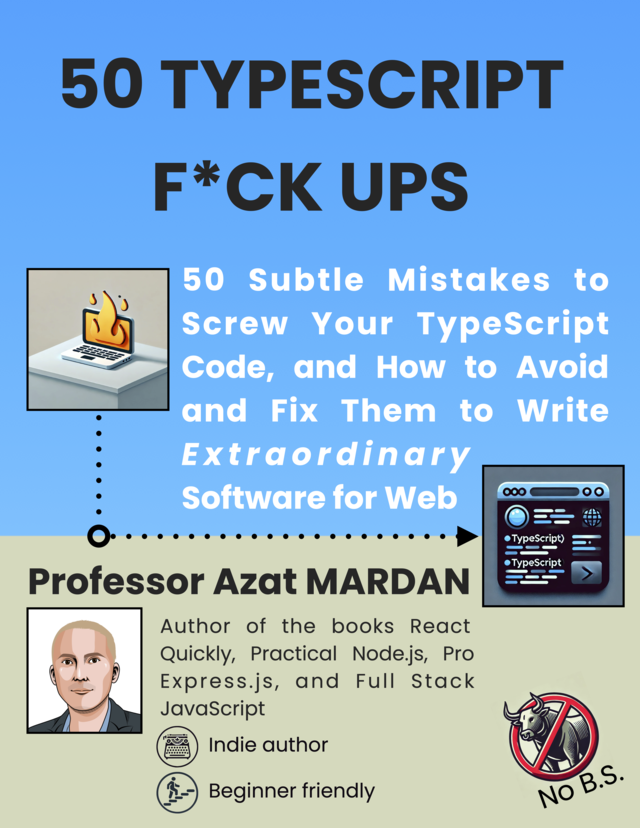

# 50 TypeScript F*ck Ups Book

## 50 Subtle Mistakes to Screw Your TypeScript Code, and How to Avoid and Fix Them to Write Extraordinary Software for Web

This book is distilled from the author's experience of working with * TypeScript for several years. It is a collection of common mistakes *that TypeScript developers make and how to avoid them. The book iswritten in a light-hearted tone and is meant to be a quick read, albeit it's over 250 pages on a US Letter format.

This book is distributed for free on Leanpub where you can download beautifully formatted PDF and EPUB files and receive email updates when the book is updated.

[Download the book on Leanpub for free](https://leanpub.com/50-ts) or read here on GitHub.

## Table of Contents

* [Welcome](00-welcome.md)

* 1. [Why TypeScript and Why This Book](01-introduction.md)
  * 1.1. Why TypeScript?
  * 1.2. How does TypeScript work?
  * 1.3. How this book is structured
  * 1.4. How to use this book
  * 1.5. For whom this book is intended
  * 1.6. Why this book will help you
  * 1.7. Summary

* 2. [Basic TypeScript Mistakes](02-basics.md)
  
  * 2.1. Using any Too Often
  * 2.2. Ignoring Compiler Warnings
  * 2.3. Not Using Strict Mode
  * 2.4. Declaring Variables Incorrectly
  * 2.5. Misusing Optional Chaining
  * 2.6. Not Using Nullish Coalescing
  * 2.7. Not Exporting/Importing Properly
  * 2.8. Not Using or Misusing Type Assertions
  * 2.9. Checking for Equality Improperly
  * 2.10. Not Understanding Type Inference
  * 2.11. Summary

* 3. [Types, Aliases and Interfaces](03-types.md)

  * 3.1. Confusing Types Aliases and Interfaces
  * 3.2. Misconceiving Type Widening
  * 3.3. Ordering Type Properties Inconsistently
  * 3.4. Extending Interfaces Unnecessarily
  * 3.5. Missing on Opportunities to Use Type Aliases
  * 3.6. Avoiding Type Guards
  * 3.7. Over-complicating Types
      * 3.7.1. Nested types
      * 3.7.2. Complex union and intersection types
      * 3.7.3. Overuse of mapped and conditional types
  * 3.8. Overlooking readonly Modifier
  * 3.9. Forgoing keyof Utility Type
  * 3.10. Under utilizing Utility Types Extract and Partial When Working with Object Types
      * 3.10.1. Ignoring Extract for narrowing types
      * 3.10.2. Avoiding Partial for marking properties as optional
  * 3.11. Summary
* 4. [Functions and Methods](04-functions.md)
  * 4.1. Omitting Return Types
  * 4.2. Mishandling Types in Functions
      * 4.2.1. Not Specifying Callback Function Types
      * 4.2.2. Inconsistent Parameter Types
      * 4.2.3. Lacking Clarity with Callbacks
  * 4.3. Misusing Optional Function Parameters
  * 4.4. Inadequate Use of Rest Parameters
      * 4.4.1. Using Rest Parameters with Optional Parameters
      * 4.4.2. Using Correct Types
      * 4.4.3. Unnecessarily Complicating the Function Signature
      * 4.4.4. Overusing Rest Parameters
  * 4.5. Not Understanding this
      * 4.5.1. Misleveraging ThisParameterType for better types safety of the this context
      * 4.5.2. Not removing this with OmitThisParameter
  * 4.6. Being unaware of call, bind, apply and strictBindCallApply
  * 4.7. Not Knowing About globalThis
  * 4.8. Disregarding Function Signatures in Object Type
  * 4.9. Incorrect Function Overloads
    * 4.9.1 Using mismatched overload signatures
    * 4.9.2. Having similar overloads
    * 4.9.3. Applying excessive overloads
  * 4.10. Misapplying Function Types
      * 4.10.1. Overloading using function types
      * 4.10.2. Creating overly complicated function types
      * 4.10.3. Confusing function types with function signatures
      * 4.10.4. Using overly generic function types
  * 4.11. Ignoring Utility Types for Functions
      * 4.11.1. Forgetting about `typeof`
      * 4.11.2. Underusing ReturnType for Better Type Inference
      * 4.11.3. Forgoing Parameters for Clearer Argument Types
  * 4.12. Summary
* 5. [Classes and Constructors](05-classes.md)
  * 5.1. Understanding When to Implement Interfaces for Classes
  * 5.2. Misusing Abstract Classes
  * 5.3. Misuse of Static Members
  * 5.4. Incorrectly Applying Access Modifiers
  * 5.5. Not Initializing Class Properties
  * 5.6. Overriding Methods Incorrectly
  * 5.7. Inconsistent Getters and Setters
  * 5.8. Not Knowing About Composition Over Class Inheritance
  * 5.9. Mishandling Promises in Constructors
  * 5.10. Not Leveraging Decorators in Classes
  * 5.11. Summary
* 6. [Advanced Parts and Bad Parts of TypeScript](06-advanced.md)
  * 6.1. Not Knowing Generic and Their Constraints
  * 6.2. Overusing Generics in Functions
  * 6.3. Failing to Use Generic Utility Types Pick and Partial
  * 6.4. Not Understanding Conditional Types in Generics
  * 6.5. Using Enums Instead of Union Types
  * 6.6. Not replacing tuples with objects when possible
  * 6.7. Not Knowing Various Type Narrowing Techniques
  * 6.8. Using Use of `instanceof` With Non-Classes
  * 6.9. Failing to Use Discriminated Unions
  * 6.10. Overlooking Async/Await Pitfalls
      * 6.10.1. Not Handling Promises Properly
      * 6.10.2. Ignoring Returned Promises
  * 6.10.3. Incorrectly Handling Concurrent Promises
  * 6.11. Summary
* [Outro](07-outro.md)
